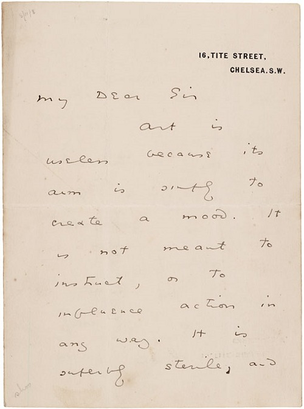
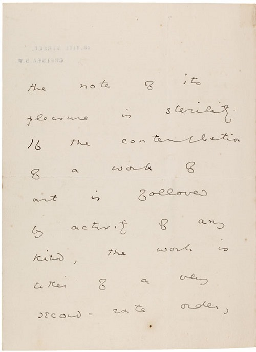
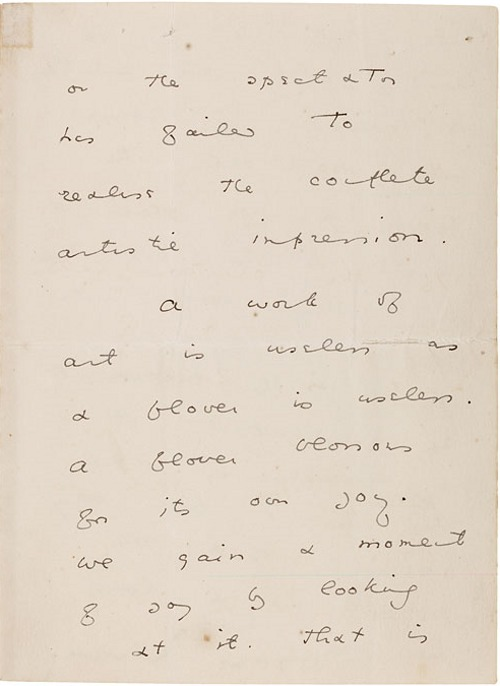
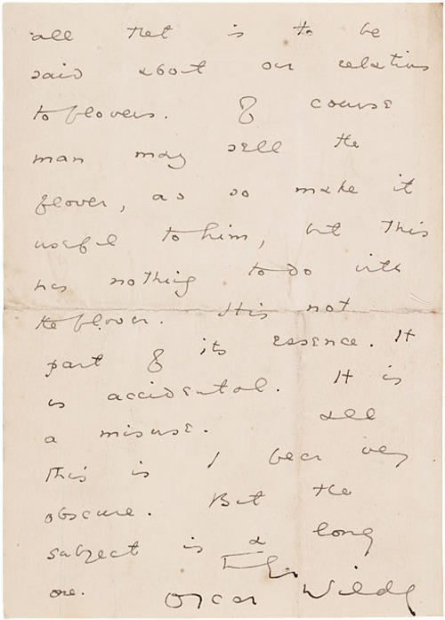

[glueyourfingers](http://glueyourfingers.tumblr.com/post/9196043306):

> _Included in the preface to Oscar Wilde’s_ The Picture of Dorian Gray _is the now famous and often misconstrued line, ‘All art is quite useless’. In fact, following the novel’s original publication in 1890, Oxford undergraduate Bernulf Clegg was so intrigued by the claim that he wrote to Wilde and asked him to elaborate. The following handwritten letter was Wilde’s response._
>
> My dear Sir
>
>  Art is useless because its aim is simply to create a mood. It is not meant to instruct, or to influence action in any way. It is superbly sterile, and the note of its pleasure is sterility. If the contemplation of a work of art is followed by activity of any kind, the work is either of a very second-rate order, or the spectator has failed to realise the complete artistic impression.
>
>  A work of art is useless as a flower is useless. A flower blossoms for its own joy. We gain a moment of joy by looking at it. That is all that is to be said about our relations to flowers. Of course man may sell the flower, and so make it useful to him, but this has nothing to do with the flower. It is not part of its essence. It is accidental. It is a misuse. All this is I fear very obscure. But the subject is a long one.
>
>  Truly yours,
>
>  Oscar Wilde
