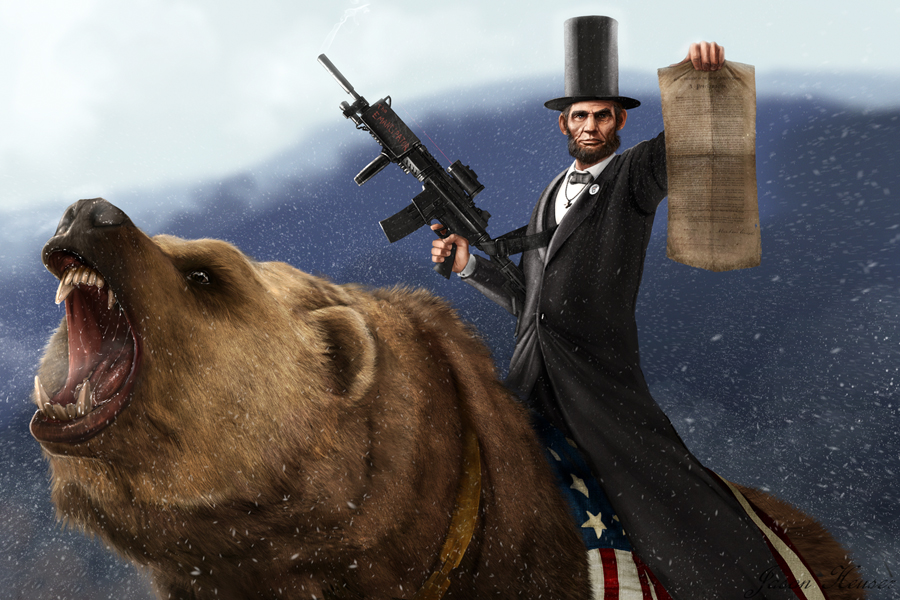
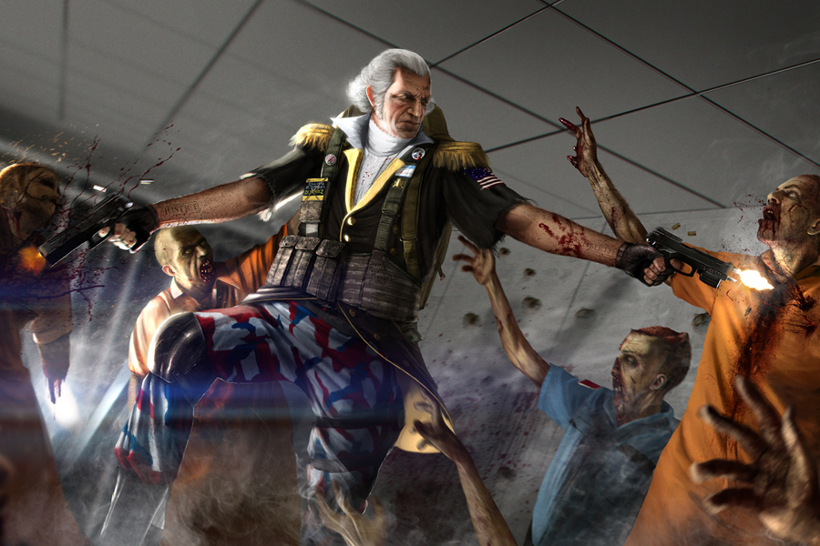
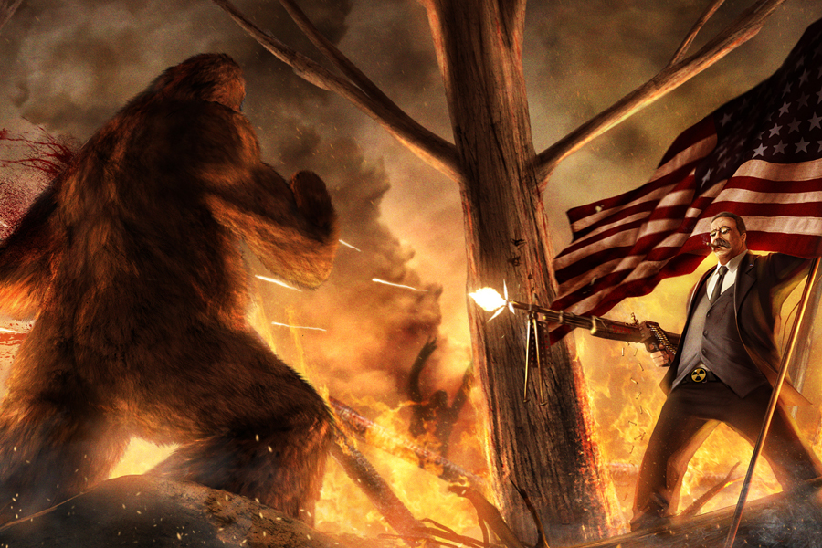
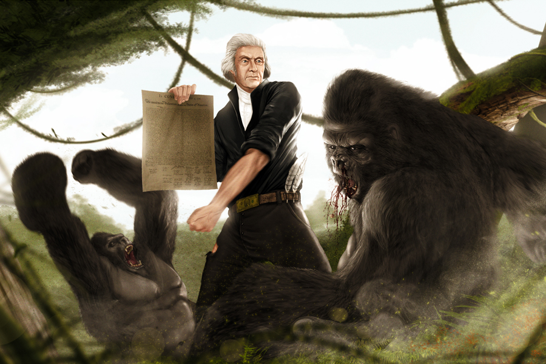
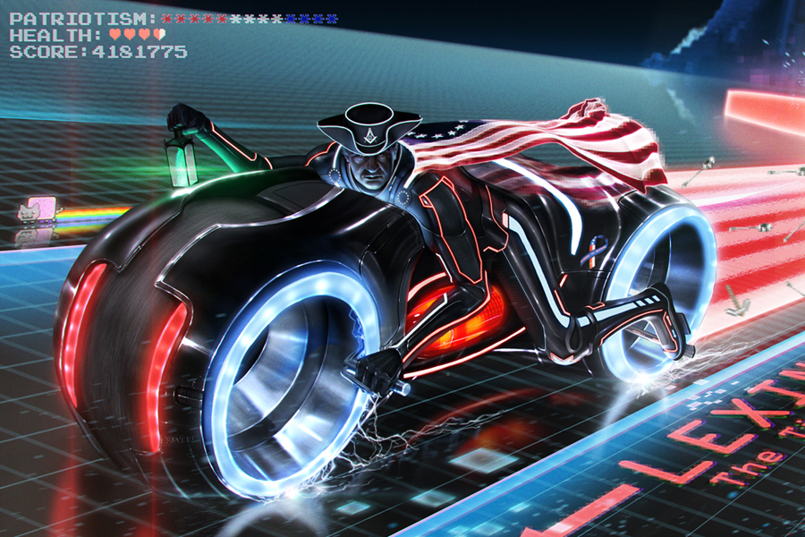
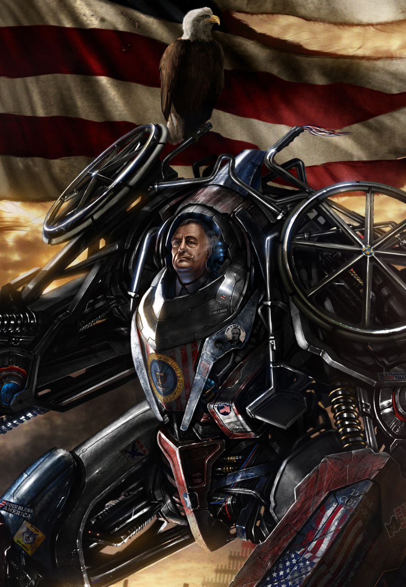
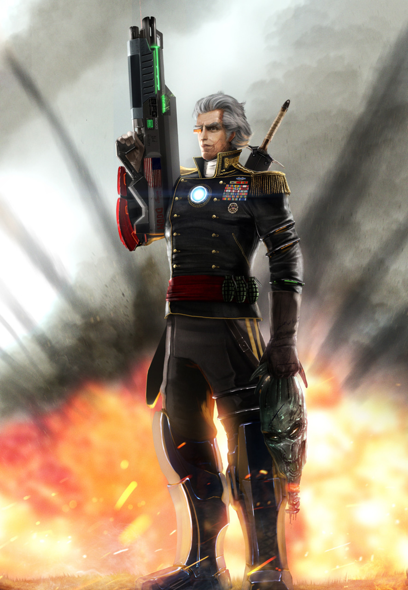

' .Abe Lincoln Riding a Grizzly .

;

' .George Washington ZombieHunter .

;

' .Teddy Roosevelt VS. Bigfoot .

;

' .Thomas Jefferson Vs Gorilla .

;

' .Paul Revere the Midnight Rider .

;

' .FDR Battle Master .

;

' .Andrew Jackson Alien Slayer .

;

I’ve posted a few of these images in the past, but here’s a good collection of several of Jason Heuser’s historical figures battling fantastical creatures.

[justinrampage](http://rampagedreality.com/post/11734776664/jheuserpreshis):

> Artist Jason Heuser has compiled a massive collection of our greatest historical figures taking their bad ass nature to a new level. Each of these pieces are available for purchase as prints from Jason’s [Etsy store](http://www.etsy.com/shop/sharpwriter?ref=pr_shop_more).
>
> _[History is Bad Ass](http://www.etsy.com/shop/sharpwriter?ref=pr_shop_more)_ by [**Jason Heuser**](http://sharpwriter.deviantart.com/) ([**Etsy**](http://www.etsy.com/shop/sharpwriter?ref=seller_info)) ([**CGHUB**](http://sharpwriter.cghub.com/)) ([**Twitter**](http://twitter.com/JasonHeuser))
