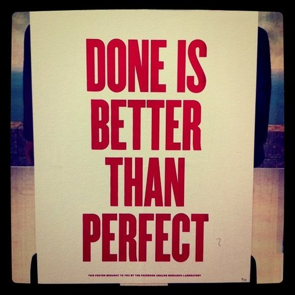

It is better than “thinking about.” It is better than “started.” It is better than “perfect.”

“Done is better than perfect,” but that doesn’t mean that to never look back at what you did. Finish something and push it out the door, show it to the world.

After that you have choices: **stop, iterate, or start something new**.

_Photo credit:[Facebook’s Analog Research Lab](http://www.facebook.com/video/video.php?v=10150096693006777&oid=75877461389) via [Cuban Council](http://blog.cubancouncil.com/pixel-perfection-meet-richard-branson-friday)_
