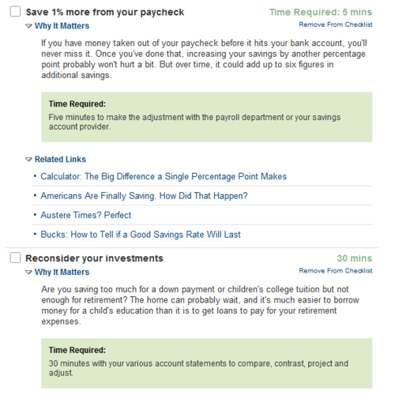

This is old but still useful. The New York Times has a [personal finance check list](http://www.nytimes.com/interactive/2010/03/24/your-money/financial-tuneup-checklist.html) with tons of useful links, calculators, videos, and other tools and media.

> Taking time out to put your personal finances in gear can reap both immediate and long-term benefits, from cashing gift cards to reallocating investments. This checklist can help you formulate a strategy, providing tips, the time needed to achieve them, and links to additional resources. For each category, Ron Lieber, the Your Money columnist, offers his insights on video. You can customize your list by removing items to suit your strategy, and then print a personalized list of the items you plan on tackling today.

A great thing about this check list is that it answers more than just the what. It also breaks down why each item is important, how to go about taking care of it, and about how long it should take.

[via](http://www.nytimes.com/2010/03/25/your-money/25INTRO.html)
