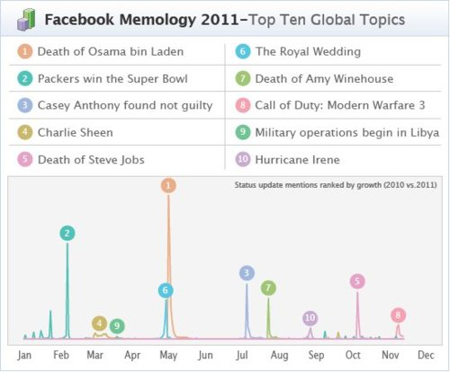

[Facebook’s Memology](http://blog.facebook.com/blog.php?post=10150391956652131) takes a look at the top 10 global topics of 2011.

> Memology takes the pulse of this global community by comparing this year’s status updates to last year’s, unearthing the most popular topics and cultural trends - or memes - emerging on Facebook. Whether it’s hmu, lms or tbh, each year brings a new set of three letter acronyms that go viral.

It’s kind of depressing list. Numbers 1, 5, 9, and 10 could warrant such broad attention. However, that the rest of them captured the attention of the hundreds of millions of Facebook users show there’s a powerful platform for spreading information being used as an alternative to E!.
