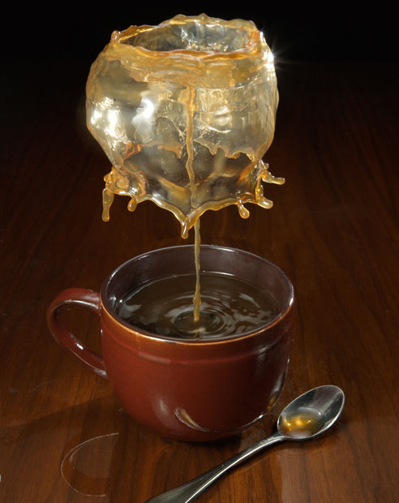

[The Telegraph](http://www.telegraph.co.uk/news/picturegalleries/picturesoftheday/8955574/Pictures-of-the-day-14-December-2011.html?image=6) has this amazing picture of coffee splashing out of its cup.

> Jack Long uses high-speed photography to capture the moment a splash is made in a cup of coffee. The Milwaukee-based photographer has taken a year to perfect his secret technique, but claims the effect is not created by dropping liquid as seen in other splash photography…

via [Laughing Squid](http://laughingsquid.com)
