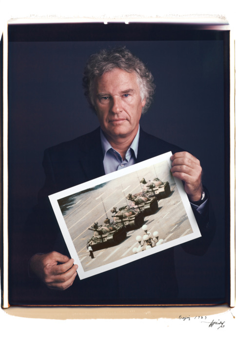

Wired has a collection of [portraits by Tim Mantoani of photographers holding prints of their most famous works](http://www.wired.com/rawfile/2012/01/famous-photogs-pose-with-their-most-iconic-images/?viewall=true).

_Photographer Jeff Widener with his iconic photo of the man in Tienanmen Square from 1989. Photo by: Tim Mantoani_

via [Kottke.org](http://kottke.org)
