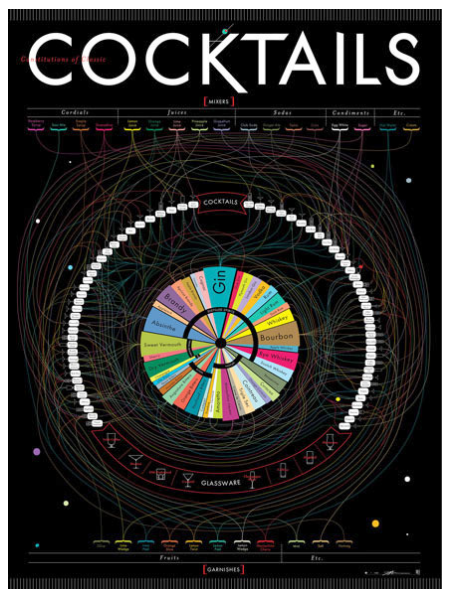

Pop Chart Lab has this [detailed diagram of many classic cocktails](http://popchartlab.com/products/constitutions-of-classic-cocktails).

> This definitive guide to classic cocktails breaks down 68 drinks into their constituent parts. Follow the lines to see where spirits, mixers, and garnishes intersect to form delightful concoctions. This massive movie poster-sized print contains over 40 types of alcohol (from distilled spirits to bitters), mixers from raspberry syrup to egg white, and garnishes from the classic olive to a salted rim. This obsessively detailed chart also includes the ratios for each drink, as well as the proper serving glass, making it as functional as it is beautiful. Over a year in the making, this is Pop Chart Lab’s most elaborate chart ever.

[Check out the big version](http://popchartlab.com/products/constitutions-of-classic-cocktails).
