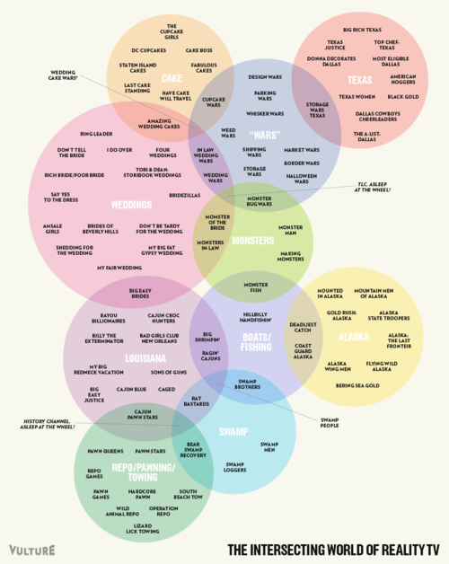

This [Venn Diagram from New York Magazine](http://nymag.com/daily/entertainment/2012/01/reailty-show-venn-diagram.html) shows an incredible amount of overlap in the titles and themes of various reality show.

Here’s the [big version](http://pixel.nymag.com/imgs/daily/vulture/2012/01/31/realitydiagram.o.png/a_980x1230.png).
