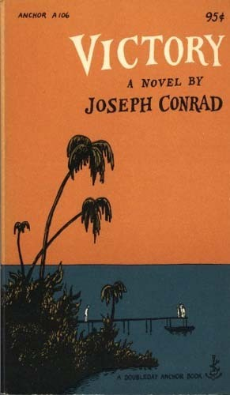

I finished reading [Victory by Joseph Conrad](http://www.gutenberg.org/ebooks/6378) a few weeks ago. Here’s a few passages (presented without comment or context) that jumped out at me:

> Thinking is the great enemy of perfection. The habit of profound reflection, I am compelled to say, is the most pernicious of all the habits formed by the civilized man.

> I prayed like a child, of course. I believe in children praying–well, women, too, but I rather think God expects men to be more self-reliant. I don’t hold with a man everlastingly bothering the Almighty with his silly troubles. It seems such cheek.

> Every age is fed on illusions, lest men should renounce life early and the human race come to an end.

> The last thing a woman will consent to discover in a man whom she loves, or on whom she simply depends, is want of courage.

> In his simplicity he was not able to give up the idea which had entered his head. An idea must be driven out by another idea, and with Schomberg ideas were rare and therefore tenacious.

> “They give you wages as they’d fling a bone to a dog, and they expect you to be grateful. It’s worse than slavery. You don’t expect a slave that’s bought for money to be grateful. And if you sell your work–what is it but selling your own self? You’ve got so many days to live and you sell them one after another. Hey? Who can pay me enough for my life? Ay! But they throw at you your week’s money and expect you to say ‘thank you’ before you pick it up.” He mumbled some curses, directed at employers generally, as it seemed, then blazed out: “Work be damned! I ain’t a dog walking on its hind legs for a bone; I am a man who’s following a gentleman. There’s a difference which you will never understand.”

> “I never heard you laugh till today,” she observed. “This is the second time!” He scrambled to his feet and towered above her. “That’s because, when one’s heart has been broken into in the way you have broken into mine, all sorts of weaknesses are free to enter–shame, anger, stupid indignation, stupid fears–stupid laughter, too. I wonder what interpretation you are putting on it?

> Clairvoyance or no clairvoyance, men love their captivity. To the unknown force of negation they prefer the miserably tumbled bed of their servitude. Man alone can give one the disgust of pity; yet I find it easier to believe in the misfortune of mankind than in its wickedness.

> Dreams are madness, my dear. It’s things that happen in the waking world, while one is asleep, that one would be glad to know the meaning of.

> A diplomatic statement […] is a statement of which everything is true, but the sentiment which seems to prompt it. I have never been diplomatic in my relation with mankind–not from regard for its feelings, but from a certain regard for my own. Diplomacy doesn’t go well with consistent contempt. I cared little for life and still less for death.

> One can die but once, but there are many manners of death.

> Woe to the man whose heart has not learned while young to hope, to love–and to put its trust in life!

