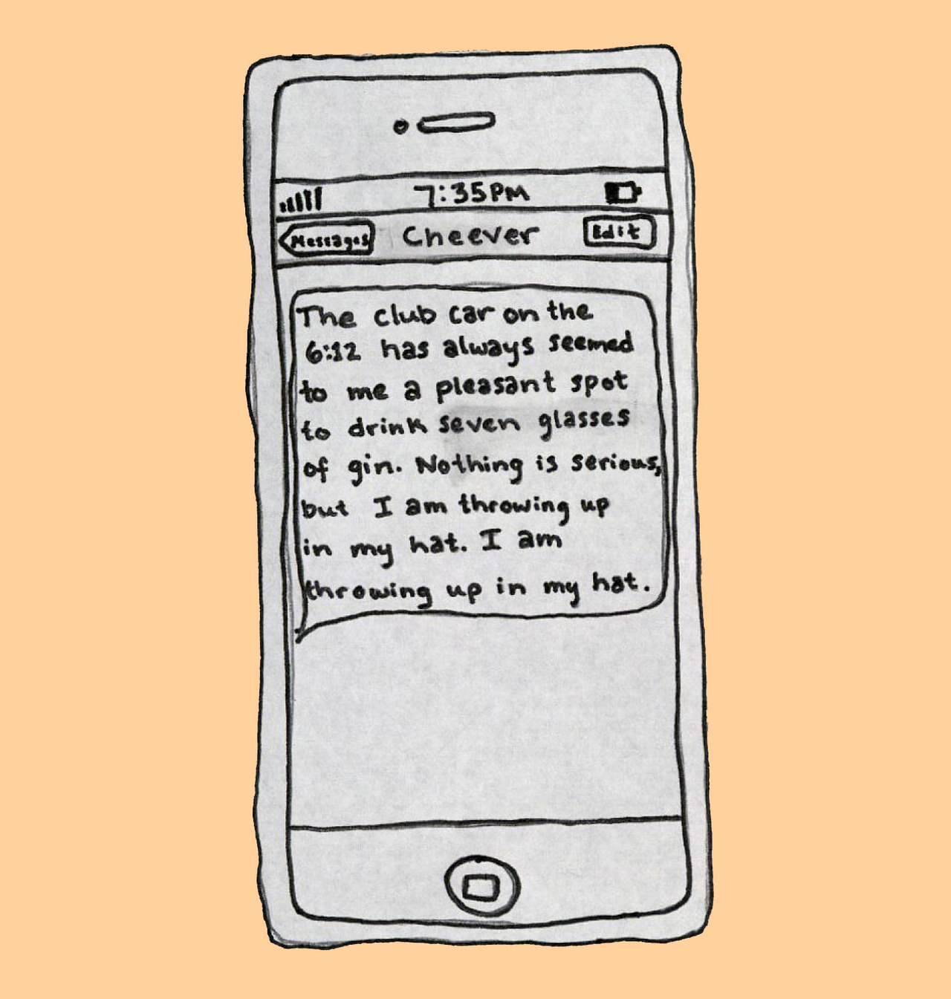
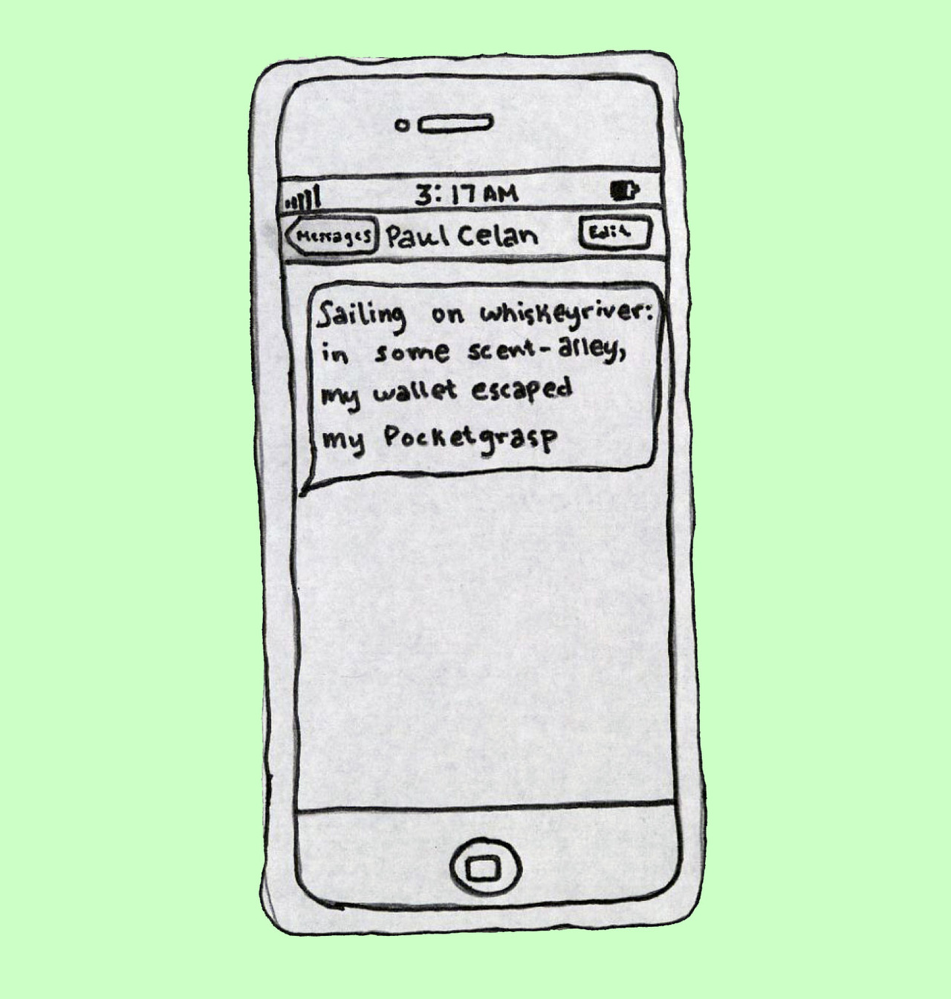
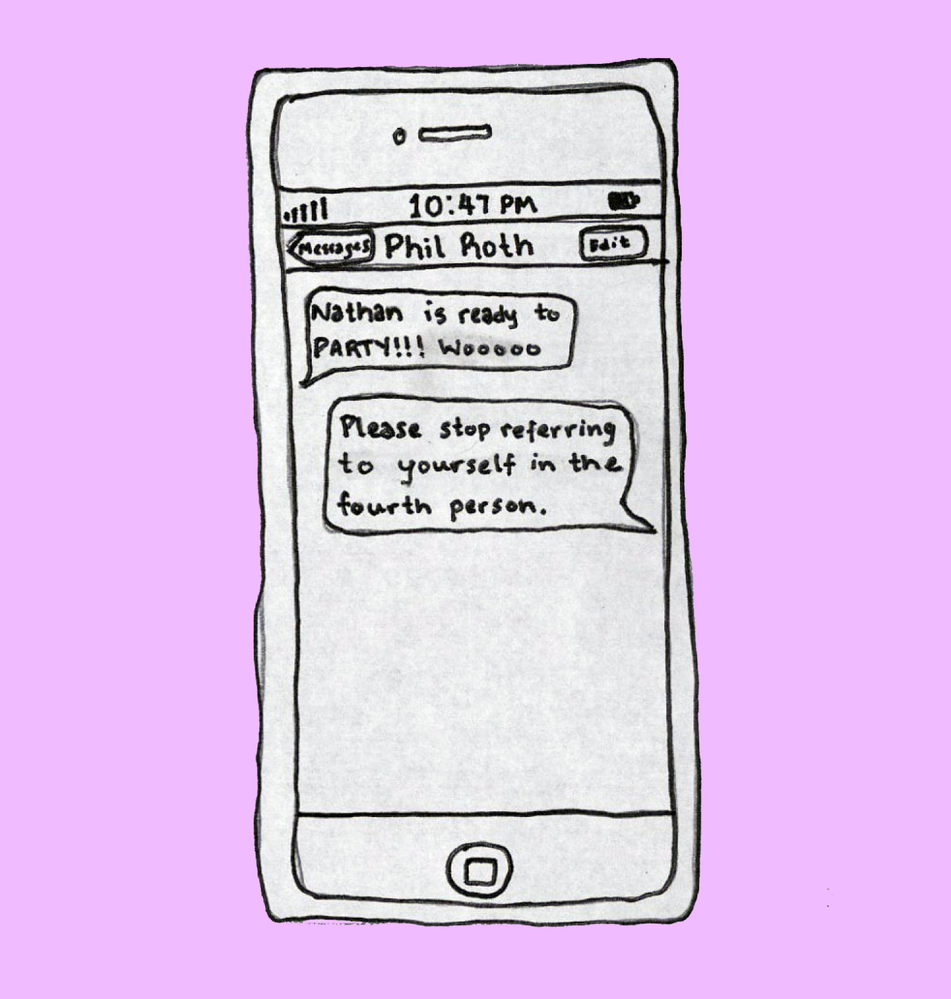

# [Drunk Texts from Famous Authors](http://www.theparisreview.org/blog/2012/06/18/drunk-texts-from-famous-authors/)

_By Jessie Gaynor via the -[Paris Review](http://www.theparisreview.org/blog/2012/06/18/drunk-texts-from-famous-authors/)_.

[Pro-tip: click the images to see them full sized]

Internet commentor,  _fer cual fer_ had several more gems to add to the collection:

> **Hemingway** : “There is a woman near the bar. I’ll try to score with her. Maybe get into some fight later on, with that man she’s talking to. Give him some good one two, like my old man used to say.”
>
> **Joyce** : “I may be drunk i don’t know you would love these tiles on the floor they look pretty i wouldn’t know since im really drunk you always said I talked nonesense when i got too many cups what would you care i miss you im so hungry right now how much for the tequila shot again.”
>
> **Faulkner** : “”Go away” Sherwood said, “Not until you edit my book” i said, “I said you go away” he said, “I insist” i said, “only if i don’t have to read it” he said, he smacked me on the head and took the book with him. And that’s how I became a writer.”
>
> **Melville** : “Cabernet Sauvignon, often referred to as the “King of Red Wine Grapes,” originally from Bordeaux, with a substantial foothold in California’s wine races, has the privilege of being the world’s most sought after red wine. Cabernet Sauvignon grapes tend to favor warmer climates and are often an ideal wine for aging, with 5-10 years being optimal for the maturation process to peak. Because Cabs take a bit longer to reach maturation, allowing their flavors to mellow, they are ideal candidates for blending with other grapes, primarily Merlot. This blending softens the Cabernet, adding appealing fruit tones, without sacrificing its innate character, and me is having another glass, sea-dog.”

Brilliant.
