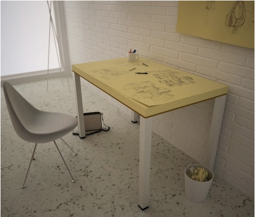
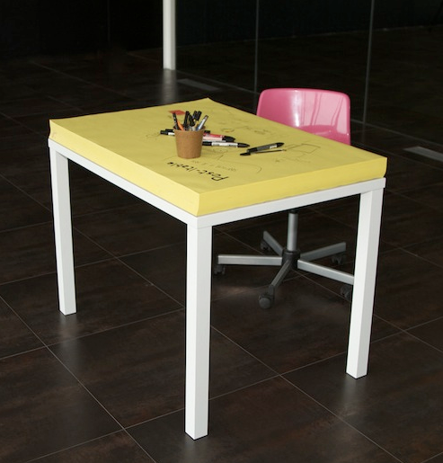
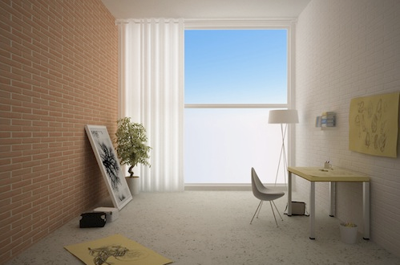
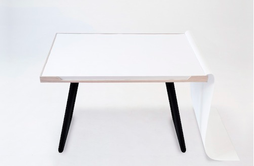
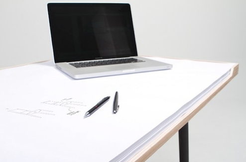

Do people still use pens?

[ryuuseikuma](http://ryuuseikuma.tumblr.com/post/25532756434/for-those-who-constantly-forget-to-wear-their):

> **For those who** constantly forget to wear their [Post-it watches](http://designtaxi.com/news/350859/Watch-Shaped-Post-Its-to-Wear-Your-Reminders/), and like to take down notes on their desks, Milan-based design firm [SoupStudio](http://www.soupstudiodesign.com/) created an almost-ideal workstation for designers that always give you access to reminders and free doodling space.
>
> http://designtaxi.com/news/352796/For-Designers-To-Constantly-Doodle-A-Giant-Post-it-Note-Desk/
