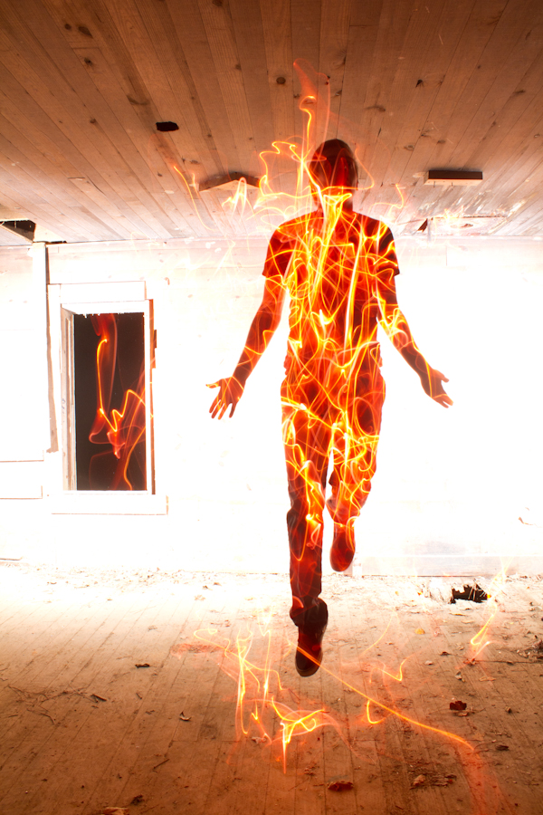
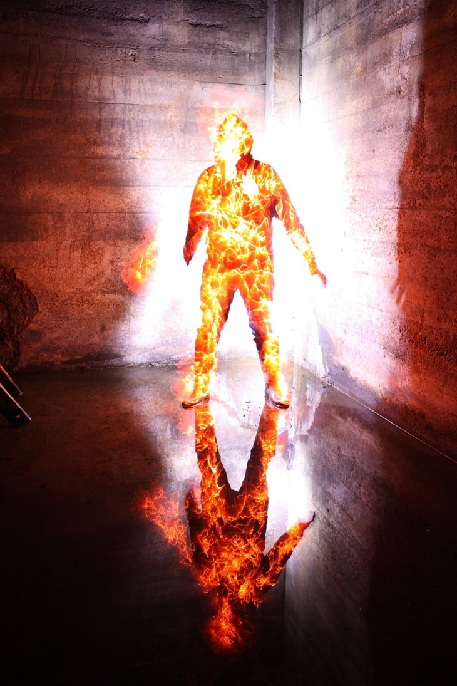
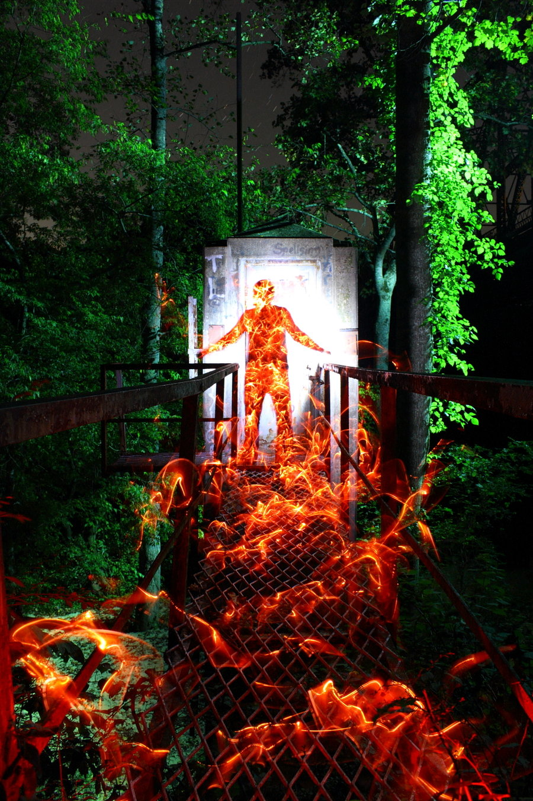
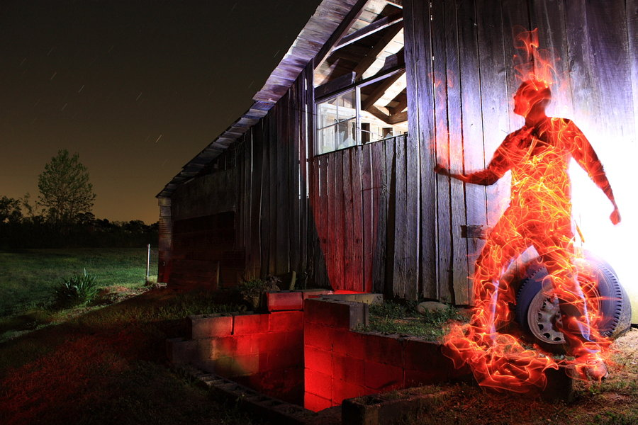

# Man on fire

[arpeggia](http://arpeggia.tumblr.com/post/32282901421):

> Photographer [Dennis Calvert](http://www.denniscalvert.net/) does not use digital manipulation for any of his pictures. With the right exposure on his camera, he swings around glow sticks in a dark room or outdoors at night to create his desired visual effect. [via [illusion](http://illusion.scene360.com/art/28838/spectacular-light-painting/)]
>
> [Website](http://www.denniscalvert.net/) - [DeviantArt](http://dennis-calvert.deviantart.com/) - [Tumblr](http://denniscalvert.tumblr.com/)
