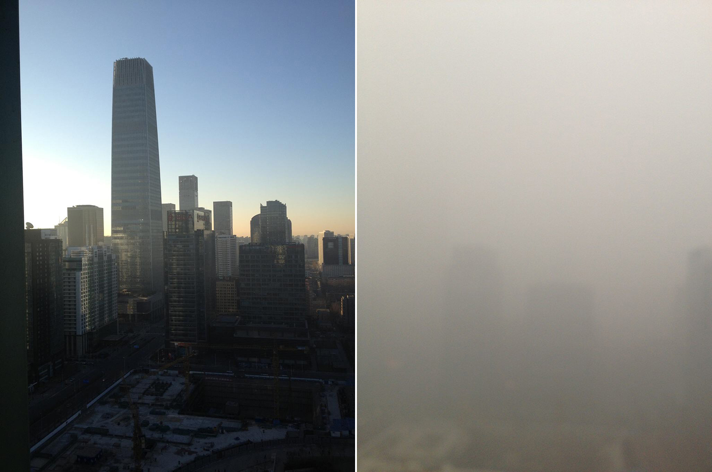

# [Beijing air pollution](http://www.washingtonpost.com/blogs/worldviews/wp/2013/02/28/the-most-shocking-photo-of-beijing-air-pollution-ive-ever-seen/):

> China’s air pollution has been bad lately. [Really, really bad](http://www.washingtonpost.com/world/beijing-residents-state-media-fed-up-with-persistent-smog-and-government-inaction/2013/01/14/46c1c2b6-5e64-11e2-9940-6fc488f3fecd_story.html). We’ve [posted photos of it before](http://www.washingtonpost.com/blogs/worldviews/wp/2013/01/15/unbelievable-photos-of-how-bad-beijings-air-has-gotten/), but the above shot really drives home how severe this has gotten.
