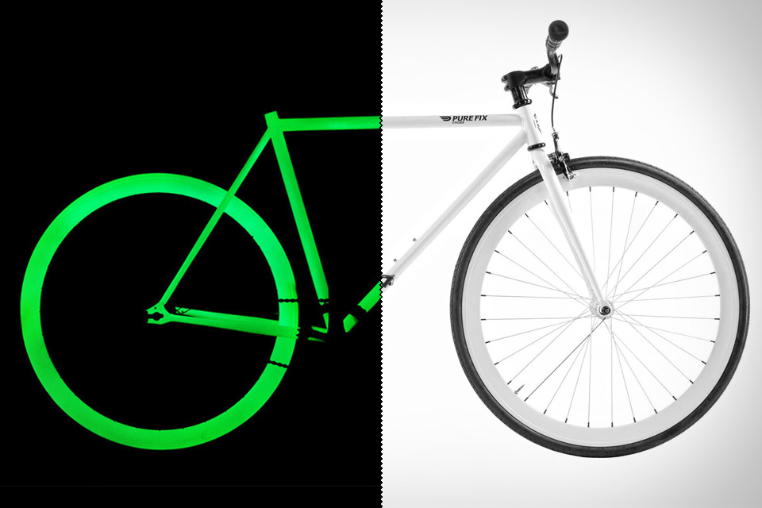

# Glow bike

This isn’t the right bike for my current riding habits, but it would be very cool to zip around town on one of these at night. The [Pure Fix Glow Bike](http://uncrate.com/stuff/pure-fix-glow-bikes/) has a clean simple look to it during the day, but lights up with an alien-green glow in the dark.

The bike is coated with a solar-activated paint that absorbs sunlight during the day and glows at night. They say an hour of sunlight will give an hour of glow, so you’d have to park it in the sun during the day if you’re planning a night ride.

It’s probably not important to have the whole bike light up. You could probably find glow paint you could use on an existing bike frame to achieve a similar effect.
