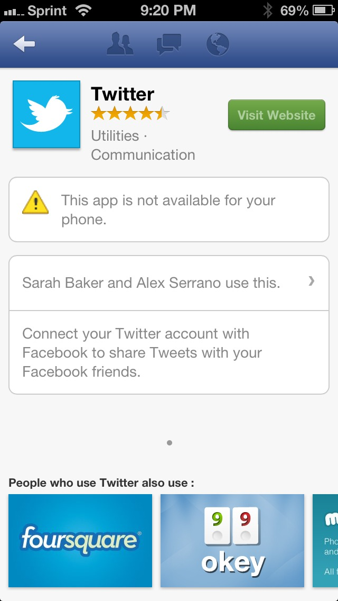

# Nice try, Facebook

Is this a deceptive or just poorly worded error message? Also the ‘Visit Website’ link is broken. I’m pretty sure there’s _some_ way to get Twitter working on my phone. The other apps at the bottom of the page work just fine.

Twitter and Facebook don’t _have_ to play nice together, but if Facebook is going to show Twitter in its App Store, it should probably just let Twitter tell its users if if works on my phone or not. Getting into the habit of telling your users what your competitors are capable of is often bound to make you look like you don’t know what you’re talking about.
