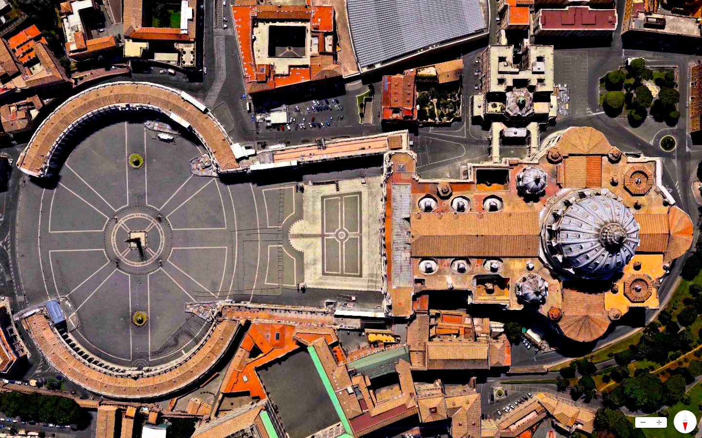

[dailyoverview](http://dailyoverview.tumblr.com/post/83350306224/easter-sunday-st-peters-basilica-vatican):

> _Easter Sunday_
>
> [St. Peter’s Basilica](http://en.wikipedia.org/wiki/St._Peter%27s_Basilica)
>
> Vatican City
>
> [41°54′8″N 12°27′12″E](http://tools.wmflabs.org/geohack/geohack.php?pagename=St._Peter%27s_Basilica&params=41_54_8_N_12_27_12_E_type:landmark_region:VA)
>
> Happy Easter from Daily Overview! St. Peter’s Basilica, located within Vatican City, is regarded as one of the holiest Catholic sites and one of the greatest churches in all of Christendom.
>
> [www.overv.eu](http://www.overv.eu)
