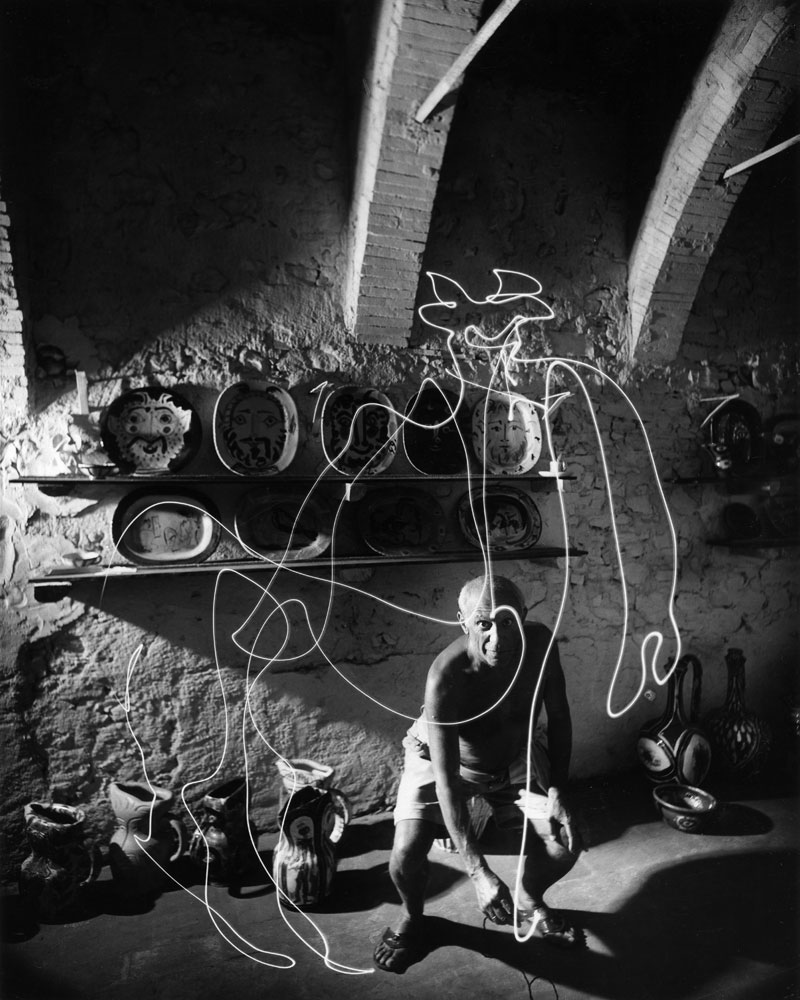

# Light Pen

[**The Best of LIFE: 37 Years in Pictures - LIFE.com**](http://life.time.com/history/the-best-of-life-37-years-in-pictures/#14)

> **1949** - Pablo Picasso drafts a centaur in mid-air with a “light pen” in southeastern France. Originally published in the January 30, 1950, issue of LIFE.
