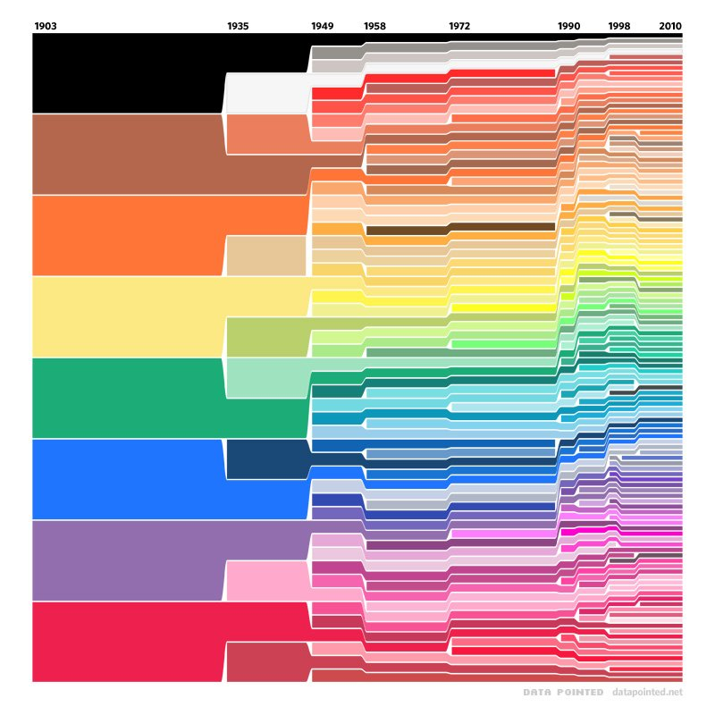

There has been an explosion in the number of colors offered by Crayola since the crayons were introduced in 1903. Slate has an article <a href="http://www.slate.com/blogs/business_insider/2014/10/05/crayola_chart_how_many_crayon_colors_have_been_added_to_crayola_box_since.html">about the colors added more recently</a>.

<blockquote>
  <a href="http://www.crayola.com/about-us/company/history.aspx">First invented in 1903</a>, the original Crayola box contained only eight colors, including red, orange, yellow, green, blue, violet, brown, and black. It sold for only a nickel.

  A&nbsp;<a href="http://www.reddit.com/r/dataisbeautiful/comments/2i6adx/crayola_color_chart_19032010/">chart posted on Reddit</a>&nbsp;shows how Crayola crayon colors have grown from eight basic hues to dozens in a little over 100 years.

  Now, there are 120 colors in the Crayola color wheel. The names have evolved as well to include colors like "denim," "screamin' green," "dandelion," and "razzle dazzle rose."
</blockquote>
