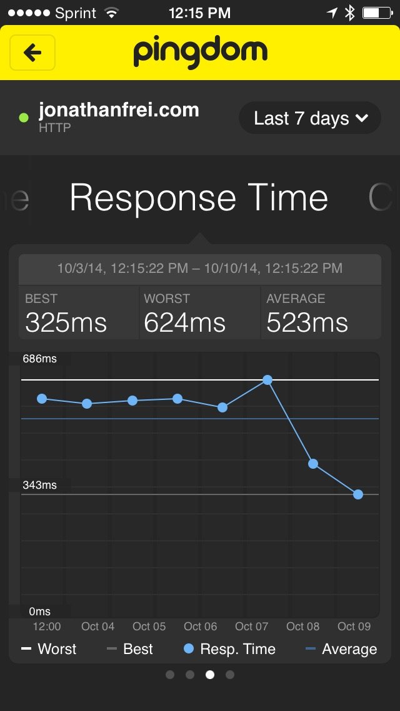

I've seen a great improvement in the response time of my site since moving from Tumblr to WordPress. Having more control over what shows up on the page along with the fast DigitalOcean SSD seems to have made a big difference in the performance of the site.

