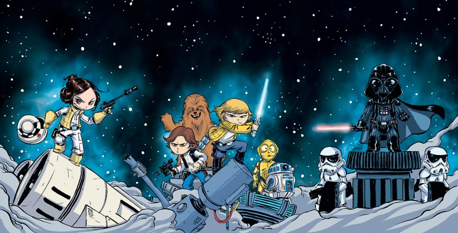

Skottie Young drew this great <a href="http://skottieyoung.com/post/100169447691/interlocking-star-wars-covers-across-all-3-marvel">interlocking cover set</a> for the first three issues of the upcoming Marvel Comics Start Wars series.

Young <a href="http://www.mtv.com/news/1965507/marvel-star-wars-skottie-young-covers">shared his excitement</a> at getting to do these covers with MTV:

<blockquote>“Like most people my age, I spent a good part of my childhood playing with ‘Star Wars’ toys for hours on end,” Young said via statement from Marvel. “I cried like a baby when I realized I left my wampa figure on the radiator and his leg melted half off.

“Flash forward years later and I get to be a little (pun absolutely intended) part of the ‘Star Wars’ universe by creating my take on these covers. It’s surreal. Also, I’ve shared that wampa story before and fans actually bring me wampa figures to cons. THIS IS MY LIFE!”</blockquote>

I've been enjoying the Star Wars series from Dark Horse and was sorry to see the publisher lose the title. However, I'm interested to see what Marvel does with the franchise now that Disney has bought it. Skottie Young doing the variant covers can't hurt.
