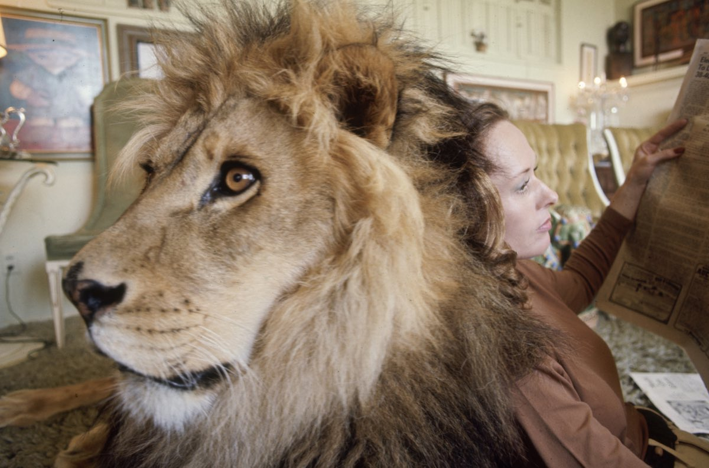
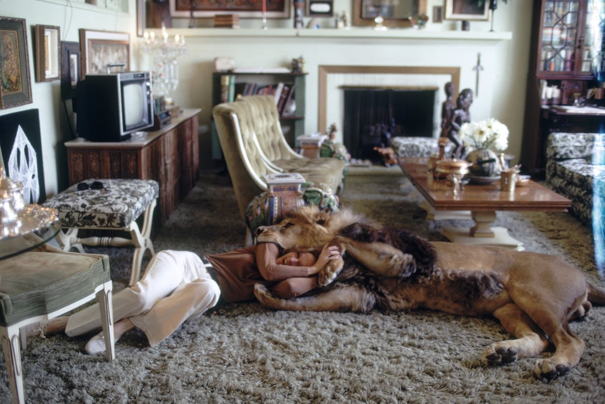

In the early 70s, Tippi Hedren--of Alfred Hitchcock’s The Birds fame--lived with her husband, teenage daughter, and a cat...but not your <a href="http://mashable.com/2014/10/06/yes-thats-just-the-pet-lion-in-the-swimming-pool/">ordinary house cat</a>.

(via <a href="http://kottke.org/14/10/the-family-pet-lion">Kottke.org</a>)
