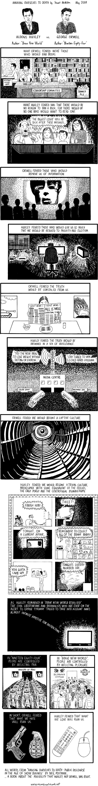

This comic by <a href="http://www.stuartmcmillen.com/">Stuart McMillen</a> suggests Aldoux Huxley had a more accurate prediction of the future in <a href="https://en.wikipedia.org/wiki/Brave_new_world"><em>Brave New World</em></a> than George Orwell had in <a href="https://en.wikipedia.org/wiki/Nineteen_Eighty-Four"><em>1984</em></a>--at least for this generation.

(via <a href="http://www.thecitrusreport.com/2011/headlines/amusing-ourselves-to-death-with-huxley-and-orwell/">thecitrusreport.com</a>)
