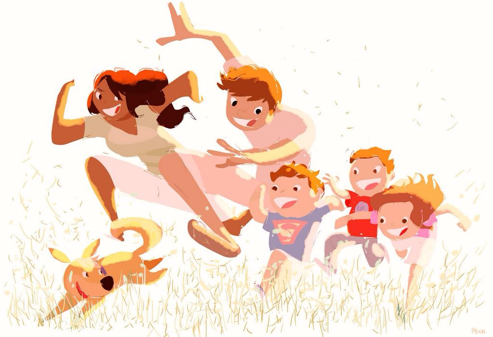
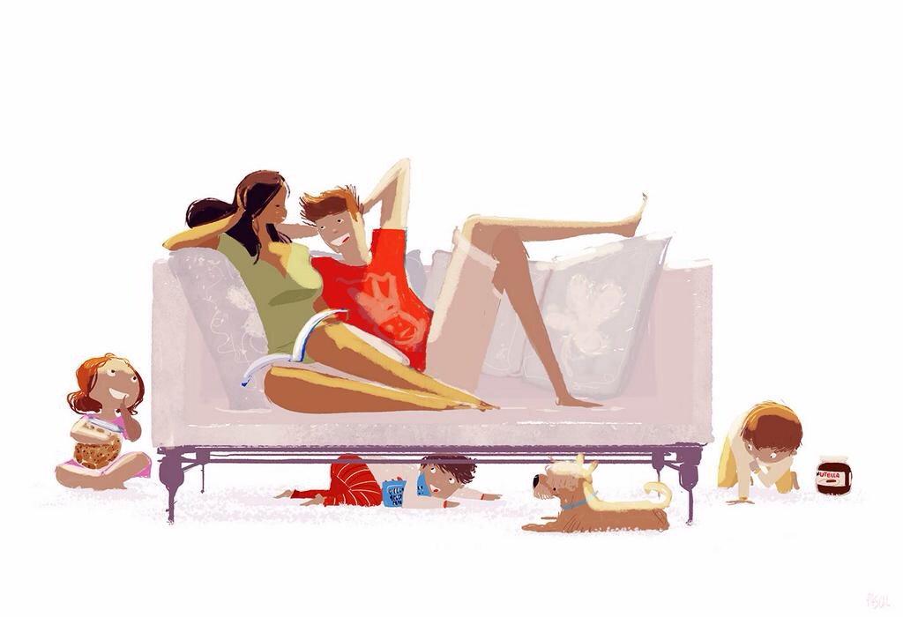
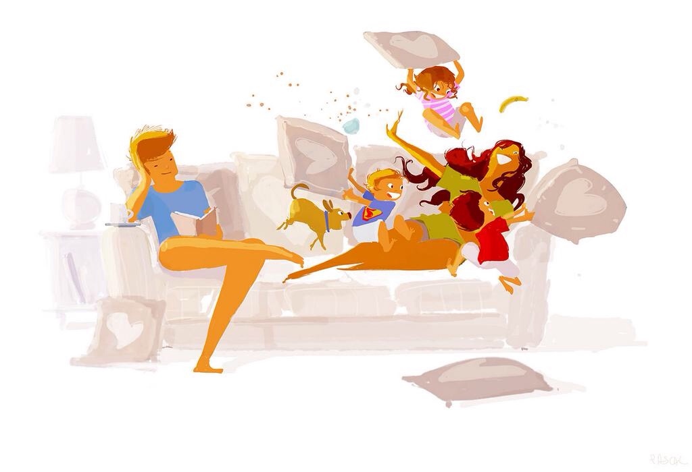
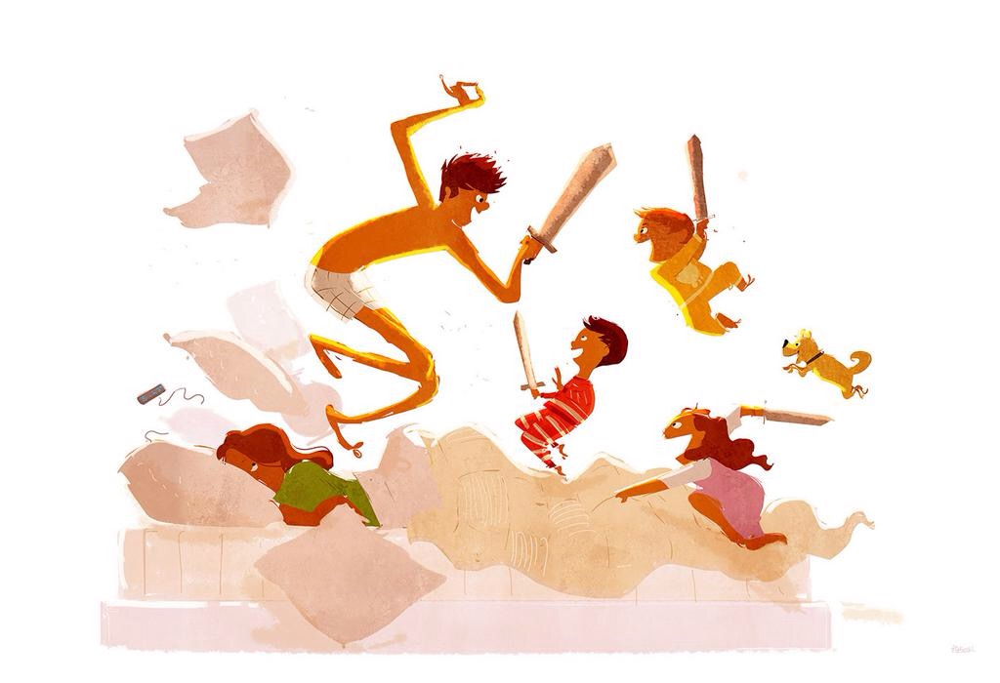
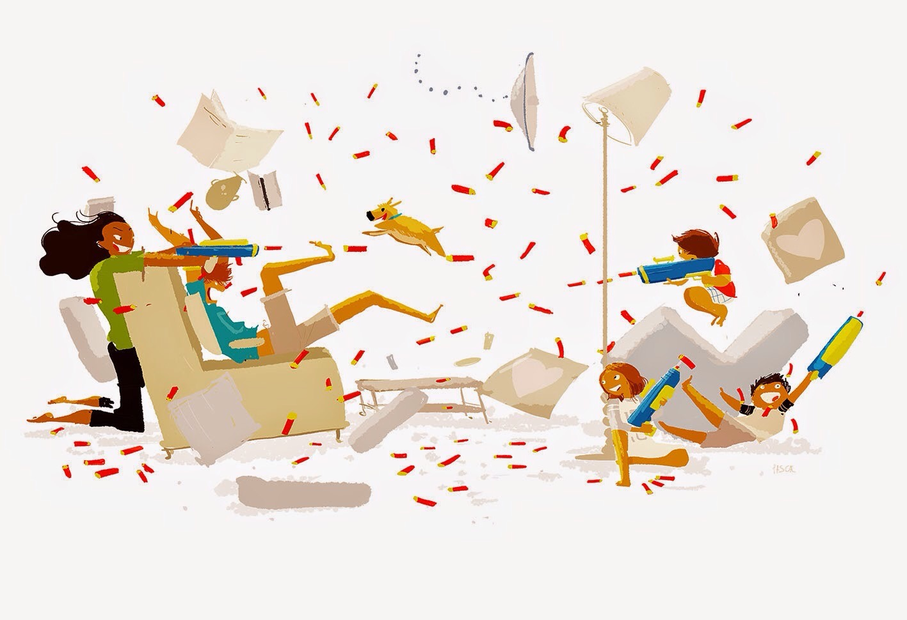
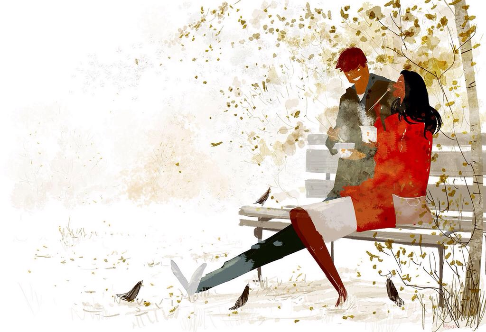

<!-- wp:paragraph -->

Well, they're&nbsp;not <em>really</em>&nbsp;of my family. The&nbsp;illustrations below are by <a href="http://www.pascalcampion.com/">Pascal Campion</a> and are of his family, which happens to have a very similar size and structure to mine.&nbsp;He posts <a href="http://www.pascalcampion.com/sketch-of-the-day/">one illustration each day</a>, and I've found myself sending Gabi the ones that remind me most of our family.&nbsp;

<!-- /wp:paragraph -->

<!-- wp:image {"linkDestination":"custom"} -->
<figure class="wp-block-image"></figure>
<!-- /wp:image -->

<!-- wp:image {"linkDestination":"custom"} -->
<figure class="wp-block-image"></figure>
<!-- /wp:image -->

<!-- wp:image {"linkDestination":"custom"} -->
<figure class="wp-block-image"></figure>
<!-- /wp:image -->

<!-- wp:image {"linkDestination":"custom"} -->
<figure class="wp-block-image"></figure>
<!-- /wp:image -->

<!-- wp:image {"linkDestination":"custom"} -->
<figure class="wp-block-image"></figure>
<!-- /wp:image -->

<!-- wp:paragraph -->

These illustrations will be even more like our family once our little girl learn to walk (run) and we get a dog.

<!-- /wp:paragraph -->

<!-- wp:paragraph -->

And this one reminds me of when Gabi and I were still dating, having one of our many long conversations on one of the benches&nbsp;outside on our university campus.

<!-- /wp:paragraph -->

<!-- wp:image {"linkDestination":"custom"} -->
<figure class="wp-block-image"></figure>
<!-- /wp:image -->

<!-- wp:paragraph -->

I highly recommend following Pascal's image of the day. You can sign up for his&nbsp;mailing list or follow him on your favorite&nbsp;social network from <a href="http://www.pascalcampion.com/">his site</a>.

<!-- /wp:paragraph -->
