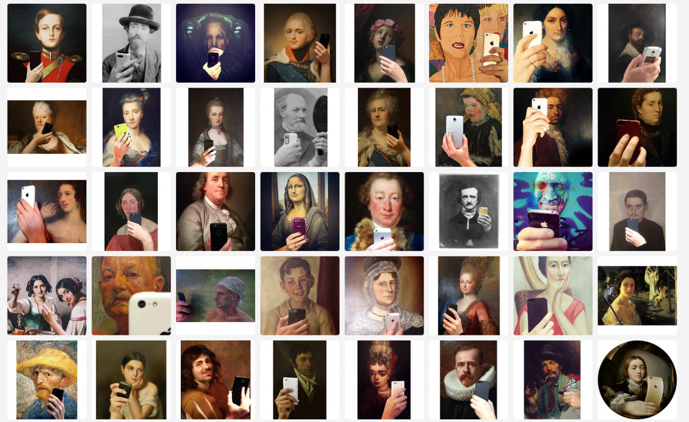

Olivia Muus created the Tumblr <a href="http://museumofselfies.tumblr.com">Museum of Selfies</a>. It is a collection of famous museum portraits who's subjects look like they are in the process of taking a selfie. Muus describes the project like this:

<blockquote>This is a project that started when my friend aka. right hand and I went to the National Gallery of Denmark in Copenhagen. I took a picture for fun and liked how this simple thing could change their character and give their facial expression a whole new meaning.</blockquote>

