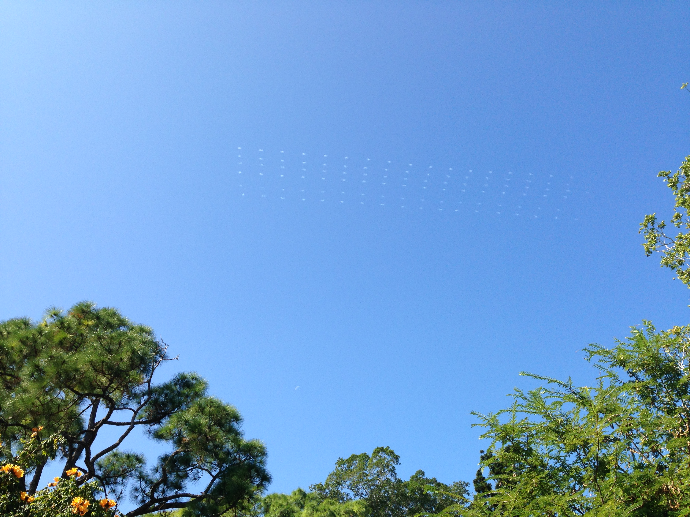

There was a very strange cloud formation in the sky earlier this morning. It was a evenly spaced,  17x6 grid of small wispy clouds. It dissipated about 5 minuets after I noticed it. There were no planes in the sky at the time. I have no idea what could have caused it. Any ideas?

