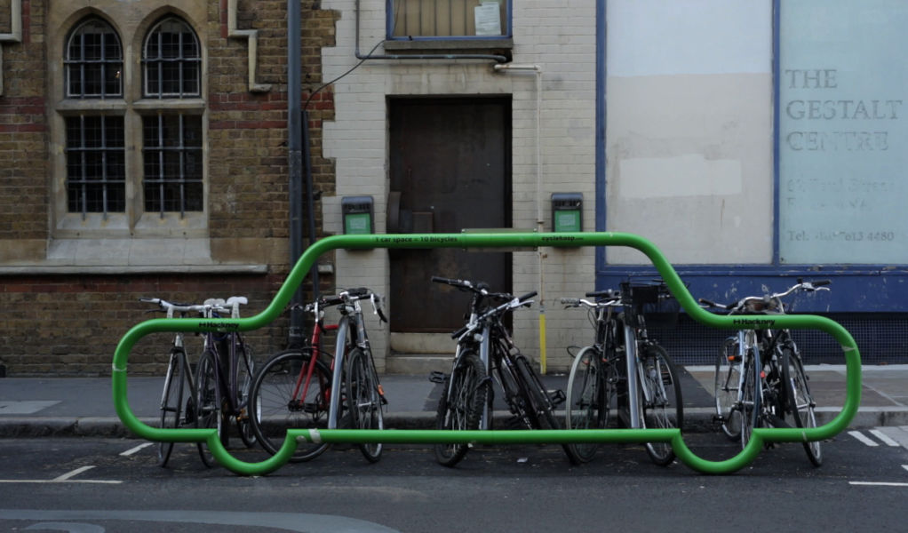

You can fit a lot of bikes in a single parking spot built for cars. This <a href="http://crane.tv/peter-murray-cyclist">bike rack by Peter Murray</a> conveys a clear message about inner city parking. (via <a href="http://www.swiss-miss.com/2014/10/clever-bike-rack.html">Swissmiss</a>)
