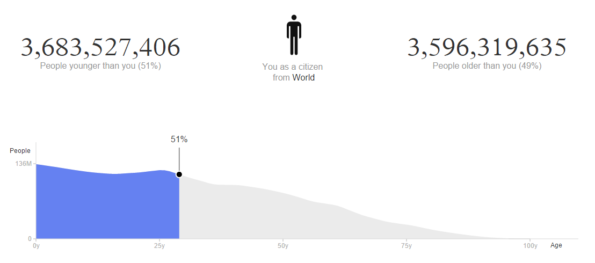
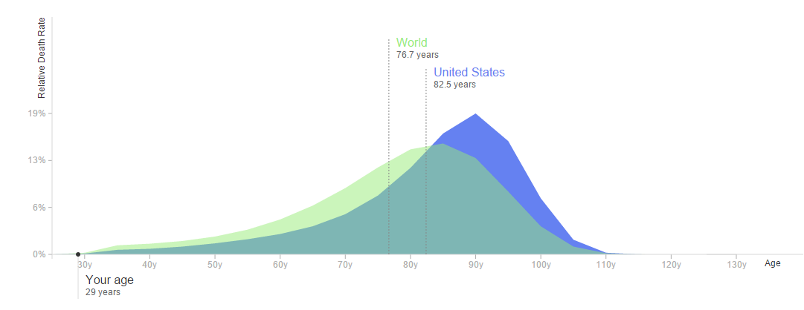

Well, this is depressing. I used to think I was one of the young ones, but it turn out I'm older than 51% of the world's population, according to data from <a href="http://population.io/#/1985/02/09/male/United%20States/summary">Population.io</a>. I still have a ways to go before I'm older than half the people in the United States, and I live in Florida, so I've got that going for me too.

<a href="http://population.io/">Population.io </a>is a data visualization project that takes demographic and population data from a variety of sources to present personalized graphs. Here's how the project's creators describe it.

> <i>Population.io</i> aims to make demography – the study of human populations – accessible to a wider audience. We believe that demographic data can play an important role in understanding the social and economic developments of our time. Our hope is that people from all walks of life, in all ages and across all countries will explore a new perspective of their own life and find their own place in the world of today and tomorrow.

Here are a couple of other interesting factoids I learned about my age in relation to the global population:

<ul>
    <li>On May 24, 2017, I'll be the 4 billionth person on the planet</li>
    <li>I'm older than 40% of the US population</li>
    <li>I share a birthday with 319, 574 other people (13,315 of whom were born during the same hour)</li>
    <li>My estimated death day is August 2, 2067 (That date is marked in my calendar thanks to the site's handy iCal download--morbid I know)</li>
</ul>

It seems I still have many years ahead of me--52.7 years--based on the average life expectancy of men in the US.

You can enter your birthday along with some other basic information into <a href="http://population.io/">Population.io</a> to find out where you fit age-wise into the global family.
