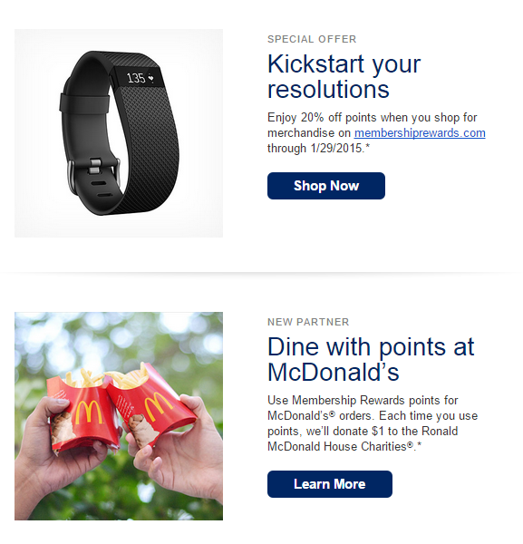

One of my credit card providers sent me an email this morning promoting some of the ways I can use my membership rewards points.

Here's a screenshot from the email:

That's right... This email promoted both discounts on fitness bands for keeping New Year's resolutions and charity bonuses for using rewards points to eat at McDonald's.

Unfortunately, I already carry a Fitbit, so I know which offer I am more likely to use.
