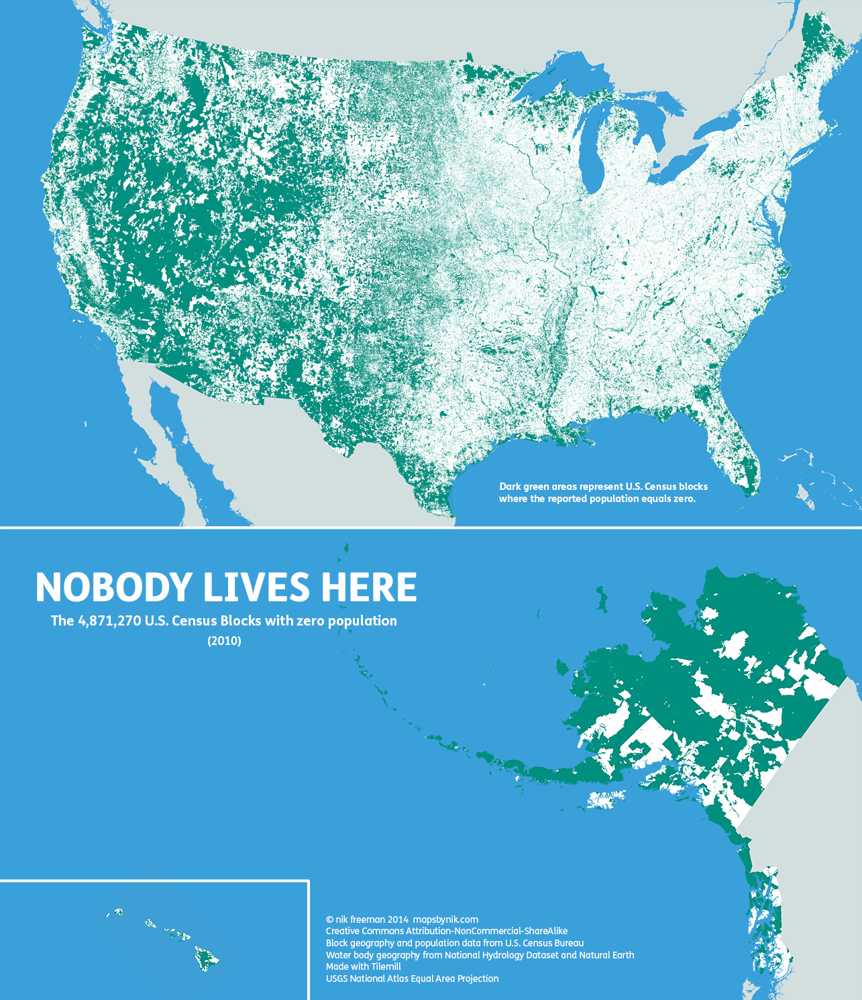

According to recent census data, <a href="http://mapsbynik.tumblr.com/post/82791188950/nobody-lives-here-the-nearly-5-million-census">47 percent of the United States' territory is uninhabited</a>.

<blockquote>A <em><a href="http://blogs.census.gov/2011/07/20/what-are-census-blocks/">Block</a></em> is the smallest area unit used by the U.S. Census Bureau for tabulating statistics. As of the 2010 census, the United States consists of 11,078,300 Census Blocks. Of them, 4,871,270 blocks totaling 4.61 million square kilometers were reported to have no population living inside them. Despite having a population of more than 310 million people, 47 percent of the USA remains unoccupied.</blockquote>

Overcrowding in cities and other population centers is more about people wanting to be where the action is than the restrictions of physical or inhabitable space.

The green on the map below shows the all territory where nobody lives.

