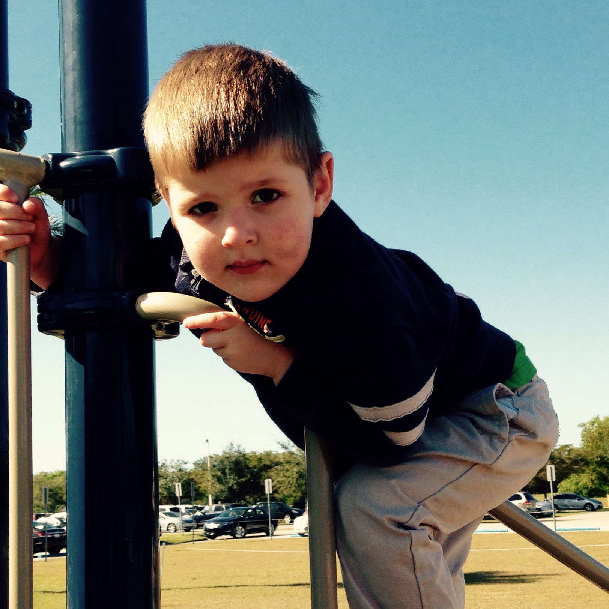
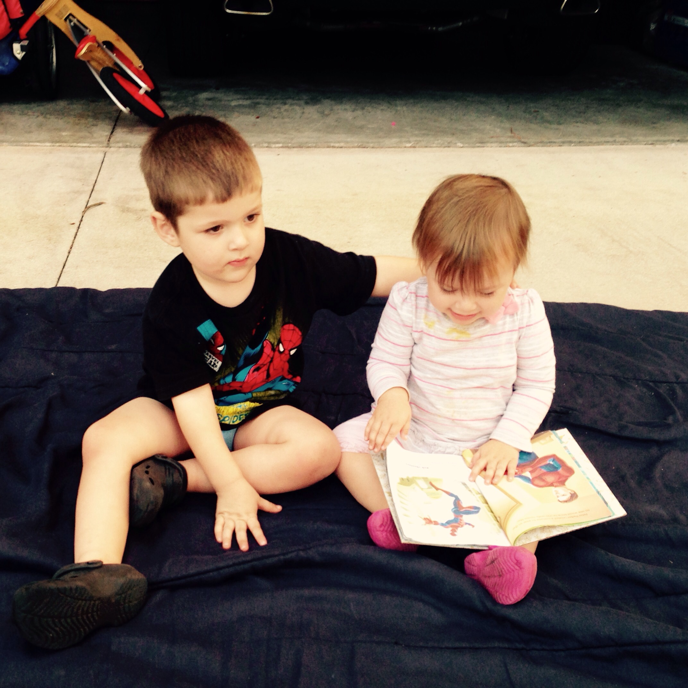
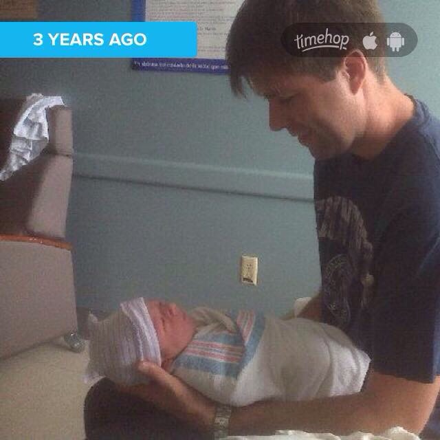

Today my middle child turned three. It has been so amazing to watch him grow up this year. It seems like he just <a href="http://jonathanfrei.com/2014/02/turning-two">turned two</a>, and suddenly he has grown into this big kid.

He is such a sweet boy and a good friend. It is so cool to see how he—as a middle child—can adapt his play between roughhousing with his older brother and being gentle (most of the time) with his baby sister. I am looking forward to another year of watching him grow up and turn into an independent young man.

