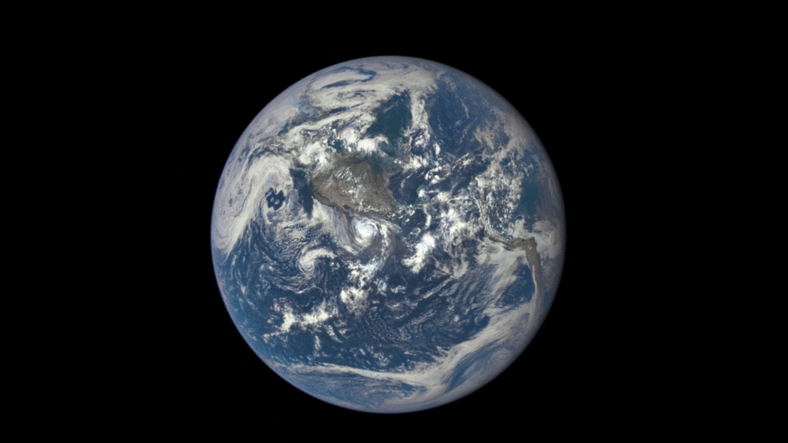

NASA recently published <a href="https://www.nasa.gov/feature/goddard/from-a-million-miles-away-nasa-camera-shows-moon-crossing-face-of-earth">an amazing set of images</a> from the far side of the moon. The photos show the moon passing in front of the sunlit surface of the earth.

<blockquote>This animation features actual satellite images of the far side of the moon, illuminated by the sun, as it crosses between the DSCOVR spacecraft's Earth Polychromatic Imaging Camera (EPIC) and telescope, and the Earth - one million miles away. Credits: NASA/NOAA</blockquote>
