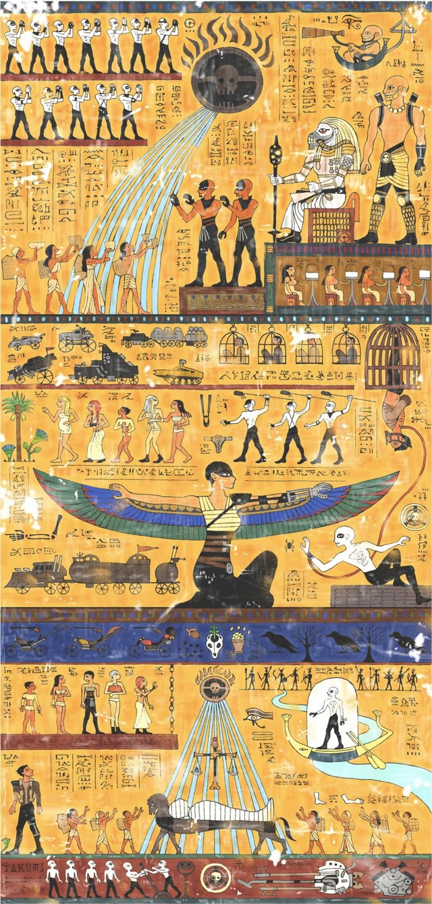

Artist and illustrator <a href="https://www.facebook.com/takumitoxin?fref=photo">Takumi</a> created this <a href="https://www.facebook.com/takumitoxin/photos/a.1402553200011242.1073741828.1402546316678597/1623484497918110/?type=1&amp;theater">Egyptian-styled telling of the story of Mad Max: Fury Road</a> (which you should totally see or see again).

Via <a href="http://kottke.org/15/09/mad-max-fury-road-as-an-ancient-egyptian-painting">Kottke</a>.
