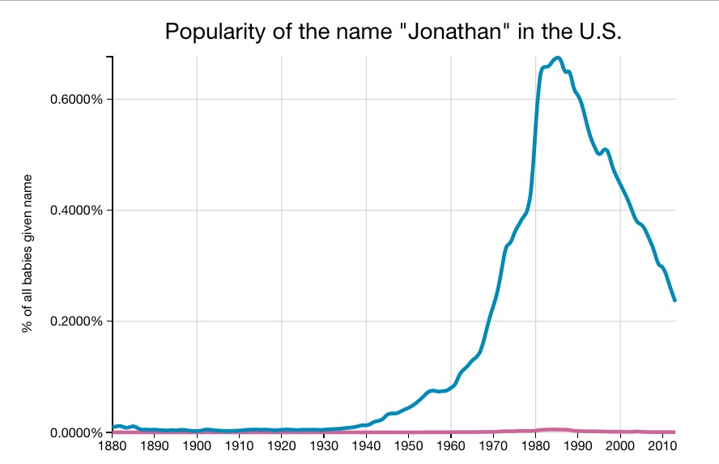
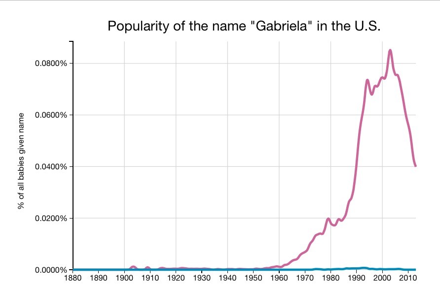

The webapp, <a href="http://rhiever.github.io/baby-name-explorer/index.html">Baby Name Explorer</a>,&nbsp;lets you see a graph of the popularity of baby names over time. The site was created by <a href="http://www.randalolson.com/">Randal Olson</a>, a researcher at the University of Pennsylvania Institute for Biomedical Informatics. The app makes it easy to see when common baby names were most popular.&nbsp;

It looks like my parents picked my name right at he height of its popularity.&nbsp;

&nbsp;
However, I don't feel like I encounter that many other Jonathan's. On the other hand, my in-laws picked a name well ahead of its time for my wife.

&nbsp;

via <a href="https://boingboing.net/2015/09/04/find-out-when-your-first-name.html">Boing Boing</a>
