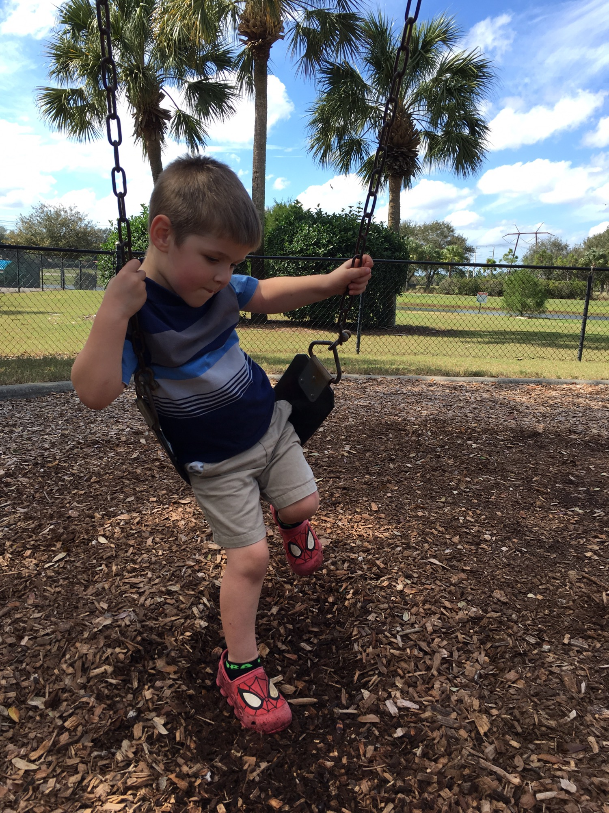
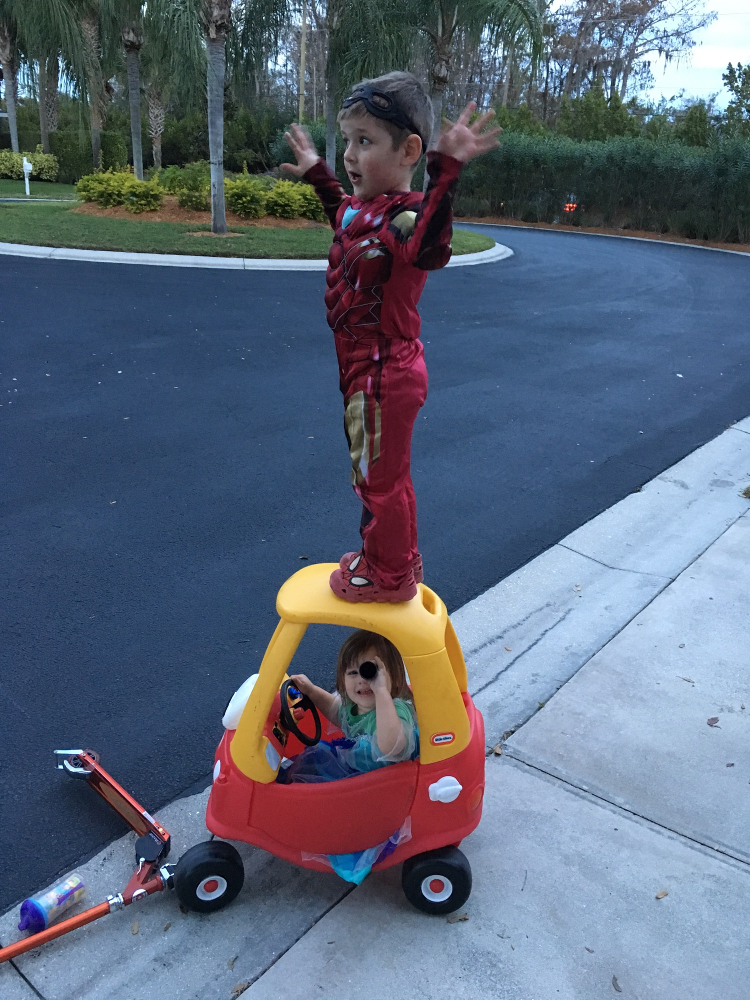

Daniel turned four yesterday. The kid is getting huge but is still so sweet. He is the luckiest middle child. Instead of being forgotten in the middle (overshadowed by his older brother or ignored because his baby sister hogs all the attention), he gets best friends on both sides--a loving big brother to look up to and a sweet little sister that shadows him everywhere.

I posted when Daniel <a href="https://jonathanfrei.com/2015/02/turning-three">turned three</a> and <a href="http://jonathanfrei.com/2014/02/turning-two">turned two</a>, and it is baffling that it is already past time to post his birthday well wishes. Gabi also wrote some <a href="https://www.facebook.com/photo.php?fbid=883084431010&amp;set=a.527197740790.2039229.144900390&amp;type=3&amp;theater">sweet words about our son</a> on Facebook and included another picture of him in his Iron Man costume--which he'd probably always wear if we let him.

