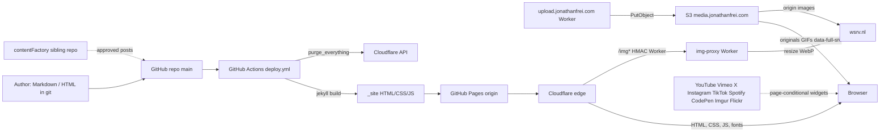
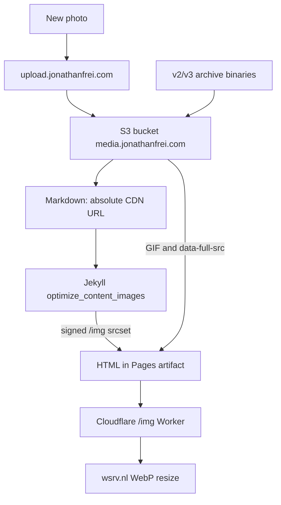

# Architecture review: jonathanfrei.com V5

This is an architecture map of the existing site, not an implementation plan. Source: GitHub `jonathanfrei/jonathanfreidotcomV5` (`main` at `ba083672`, pushed 2026-08-28) plus the local clone at `C:\Users\jfrei\jonathanfreidotcomV5`. Adjacent systems that the site depends on but that live outside this repo are called out separately.

**Site:** https://jonathanfrei.com  
**Repo:** https://github.com/jonathanfrei/jonathanfreidotcomV5  
**Shape:** static Jekyll 4 site. No app server, no database, no analytics, no comment system.

---

## 1. One-sentence summary

Markdown and HTML in GitHub are built by Jekyll in GitHub Actions, published to GitHub Pages, served through Cloudflare, with photos on S3 and on-the-fly image transforms behind a same-origin Cloudflare Worker.



---

## 2. Runtime request path

A visitor hitting `https://jonathanfrei.com/...` never talks to Jekyll. Jekyll only runs in CI.

1. **DNS / TLS.** Apex `jonathanfrei.com` is proxied on Cloudflare. SSL/TLS mode is **Full** (not Full strict: GitHub Pages has no apex cert; not Flexible: that would emit `http://` origin redirects). Always Use HTTPS is on.
2. **Redirects (Cloudflare, dashboard, not in git).** `www` → apex. Trailing slash stripped except `/`, `/archive/YYYY/MM/`, `*/page/N/`, and `/img/`.
3. **Route split.**
   - Path starts with `/img` → **img-proxy Worker** (HMAC check, then fetch wsrv.nl). Cached ~30 days on 200s; errors `no-store`.
   - Everything else → **GitHub Pages** origin (Fastly behind Pages).
4. **Cache.** HTML is Cache Everything at the edge (2h). CSS/JS/fonts/images get a long-TTL asset rule. `/search.json` is excluded from the HTML rule because tag/category search reads it. Deploy purges the whole zone so the 2h HTML TTL cannot serve a stale homepage.
5. **Browser.** Vanilla first-party JS. Third-party scripts load only when a page contains a matching embed. Images are same-origin `/img?url=…&s=…` (signed); GIFs and `data-full-src` originals stay on `media.jonathanfrei.com` or the hotlink host.

There is no origin application. GitHub Pages serves files. Cloudflare adds DNS, TLS, redirects, HTML cache, Early Hints for two WOFF2 files, Brotli, and the `/img` Worker.

---

## 3. Build and deploy

**Trigger:** push to `main` (docs-only paths ignored) or `workflow_dispatch`. No cron. Future-dated posts publish on the next content push (`future: true` in `_config.yml`).

**Workflow:** `.github/workflows/deploy.yml`

| Step | Tool |
|---|---|
| Checkout full history (`fetch-depth: 0`) | `actions/checkout@v7` |
| Ruby 3.3 + Bundler cache | `ruby/setup-ruby@v1` |
| Pages base path | `actions/configure-pages@v6` |
| `bundle exec jekyll build` | Jekyll 4.x |
| Artifact upload | `actions/upload-pages-artifact@v5` |
| Publish | `actions/deploy-pages@v5` |
| Purge edge | Cloudflare API `purge_cache` |

**Build env:** `JEKYLL_ENV=production`, `ARCHIVE_MEDIA_MODE=cdn`, `TZ=America/New_York`, `IMG_HMAC` (required). CI fails if `_site/media` appears (S3 offload) or if `IMG_HMAC` is missing.

**Not in CI:** Cloudflare Worker deploys. Changing `workers/img-proxy/src/index.js` requires a separate Wrangler/dashboard deploy. The Worker secret `IMG_HMAC` must match the Actions secret.

**Lockfile:** `Gemfile.lock` is in `.gitignore`. CI resolves gems from `Gemfile` ranges on each run (`jekyll ~> 4.3`, plugin `~>` ranges). Direct versions are not pinned.

---

## 4. Jekyll site internals

### 4.1 Content types

| Kind | Source | URL | Layout |
|---|---|---|---|
| Home | `index.md` | `/` | `default` |
| Essays | `_posts/YYYY-MM-DD-slug.md` | `/:year/:month/:day/:title` | `post` |
| Link posts | same folder, `layout: link` + `url:` | same permalink shape | `link` |
| Historical imports | `_posts/v{1,2,3}-archive/` | same permalink; category kept for filters | `post` |
| Books | `_books/<slug>/` nested markdown | `/books/<slug>/…` | `book` |
| Pages | `_pages/*.md` | `/about`, `/blog`, `/tags`, … | `page` (mostly) |
| Editorial Markdown | `editorial/*.md` + `layout: editorial` | `/editorial/<slug>` | `editorial` |
| Handcrafted HTML | `editorial/<slug>.html` | `/editorial/<slug>` | none (static drop-in) |
| CSS artifacts | `assets/css/{core,editorial,book,main}.html` | `/assets/css/*.css` | null (Liquid copies includes) |
| Feeds / indexes | `feed.xml`, `search.json`, `_pages/robots.html` | `/feed.xml`, `/search.json`, `/robots.txt` | null |

Permalink rule: **no trailing slash** on HTML pages so Jekyll writes `about.html` and GitHub Pages serves `/about`. Month archives and paginated indexes keep the slash (`directory/index.html`).

Timezone is `America/New_York` so evening Eastern dates do not roll to the next UTC day in `/:year/:month/:day/` paths.

### 4.2 Stream, search, taxonomy

- **`/blog`** is a mixed stream of essays and links, paginated by `_plugins/stream_pages.rb` (config `pagination.per_page` is 100). Page 1 is `blog.html`; later pages are `/blog/page/N/`. `/posts` and `/links` redirect to `/blog`.
- **Month archives** only are generated by `jekyll-archives` at `/archive/:year/:month/`.
- **Tags and categories** are query-driven: `/tags?tag=name`, `/categories?category=name`. No `/tags/:name` HTML. Old paths 404-redirect via an inline script in `head.html`.
- **Search** is client-side. `search.json` is a thin dump of `site.data.search_index` (title, url, dates, excerpt, tags, categories, first image). `assets/js/search.js` fetches `/search.json?v=<build time>`.

### 4.3 Custom plugins (`_plugins/`)

These are first-party Ruby, not gems. They are the bulk of the site’s behavior.

| Plugin | Role |
|---|---|
| `pages_dir.rb` | `_pages/foo.md` → `/foo` |
| `books.rb` | Nested book slugs, TOC JSON, prev/next, noindex |
| `stream_pages.rb` | Paginated `/blog` without trailing slash on page 1 |
| `site_index.rb` | One-pass search/tag/category/month indexes |
| `post_metadata.rb` | `last_modified_at` from git; reading time |
| `normalize_tags.rb` | Coerce/alias tags; drop leftover tag archive pages |
| `link_posts.rb` | Link-post `url:` + Open Graph card fetch (fail-soft, cached) |
| `url_embeds.rb` | Standalone media URLs → platform embeds |
| `fix_archive_media.rb` | Rewrite v1/v2/v3 `media/` paths to S3; keep binaries out of the artifact |
| `optimize_content_images.rb` | `srcset` via signed `/img`; lazy/LCP; hotlink proxy |
| `static_html_pages.rb` | `editorial/<slug>.html` → clean permalink |
| `static_html_image_roots.rb` | Treat static-HTML images as own media |
| `asset_cdn.rb` | `asset_url` → `/assets/…?v=<content hash>` |
| `drop_cap.rb` | Auto drop caps on long prose posts |
| `heading_anchors.rb` | H2/H3 permalinks |
| `aside_pairs.rb` | Pair `.aside` with the preceding block for wide-screen layout |
| `content_filters.rb` | List excerpts (2–3 `<p>`; skip GIF-only paragraphs) |
| `build_errors.rb` | Fail-soft: skip a bad post, write `_site/build-errors.log` |

Official Jekyll plugins (gems): `jekyll-feed` (writes an unused file; `/feed.xml` is authored), `jekyll-seo-tag`, `jekyll-sitemap`, `jekyll-archives` (months only), `jekyll-relative-links`. Markdown is **kramdown** with **Rouge** highlighting and `parse_block_html: true`.

### 4.4 Front-end

No bundler, no React, no CSS framework.

- **Tokens / chrome:** `_includes/main.css` → `/assets/css/core.css?v=`
- **Feature sheets** inlined only when needed (`optional-css.html`): code, search, embeds, pagination
- **Editorial / book** extra sheets linked on those layouts
- **Fonts:** self-hosted Fontsource latin WOFF2 under `/assets/fonts/` (Source Serif 4 5.2.5, Source Code Pro 5.2.5, Source Sans 3 5.3.0). Source Sans is vendored but not first-paint preloaded
- **JS (first-party):**
  - `search.js` — query-string search/tag/category
  - `book-nav.js` — hamburger TOC from `/books/<slug>/toc.json`
  - `code-blocks.js` — wrap/copy/line numbers, only if `<pre>`
  - `theme.js` — light/dark, loaded on first footer-toggle click
  - Tiny inline scripts in `head.html` (theme boot, image `data-full-src` fallback, 404 tag redirect)

Nav: Home, Blog, Archive, About. Contact is a masked `mailto:`. Edit links go to GitHub (`_includes/post-actions.html`).

---

## 5. Media pipeline



- **Archive media** (`_posts/v{2,3}-archive/…/media/…`) lives on S3 at `https://media.jonathanfrei.com/v{2,3}-archive/media/…`. Not in the Pages artifact (deploy-pages 10-minute cap).
- **New photos** are uploaded by a **separate** Cloudflare Worker (`contentFactory/tools/upload-worker`, hostname `upload.jonathanfrei.com`) to `assets/img/{yyyy}/{timestamp}-{slug}.ext`. Markdown stores the absolute CDN URL. Binaries are not committed.
- **Transforms:** production HTML never points the browser at `wsrv.nl`. The browser hits `https://jonathanfrei.com/img?url=…&w=…&output=webp&q=85&we&s=<hmac>`. The Worker verifies HMAC + referer, then fetches wsrv. Unsigned URLs 403.
- **GIFs** skip `/img`. Hotlinked third-party `` are rewritten through `/img` when `archive_media.optimize.hotlink` is on.

---

## 6. Directory map

```
.github/workflows/deploy.yml   CI: build, Pages deploy, Cloudflare purge
workers/img-proxy/             Cloudflare Worker source (deployed separately)
_config.yml                    Site, plugins, permalinks, media, excludes
_plugins/                      First-party Jekyll generators and hooks
_includes/                     Chrome, CSS, stream/search partials
_layouts/                      default, post, link, page, book, editorial, archive
_pages/                        Root URLs (/about, /blog, /tags, …)
_posts/                        Essays, link posts, v1–v3 archive imports
_books/                        Nested books → /books/<slug>/
editorial/                     Markdown editorials + static HTML drop-ins
assets/css/*.html              Generated CSS permalinks
assets/js/                     Vanilla JS
assets/fonts/                  Self-hosted WOFF2
feed.xml / search.json         Authored RSS + search index template
AGENTS.md                      Agent contract (constraints, do-not-regress)
```

Excluded from the build: `Gemfile*`, `vendor`, `node_modules`, `.github`, `README.md`, `AGENTS.md`, `scripts`, `workers`, `assets/deprecated`, residual `_posts/v*-archive/media`.

---

## 7. Third-party dependencies

Grouped by when they run. First-party code (this repo’s Ruby/JS/CSS) is not listed.

### 7.1 Hosting and edge (always on)

| Dependency | Role | Where configured |
|---|---|---|
| **GitHub** | Source of truth, PR/issue tracker, `Edit` links | repo + `post-actions.html` |
| **GitHub Actions** | Build + deploy | `.github/workflows/deploy.yml` |
| **GitHub Pages** | Static origin (Fastly) | repo Settings → Pages, Actions source |
| **Cloudflare** | DNS, TLS Full, redirects, HTML/asset cache, Early Hints, Brotli, zone purge | dashboard (rules documented in README, **not in git**) + `CLOUDFLARE_*` secrets |
| **Amazon S3** (`us-east-1`, bucket `media.jonathanfrei.com`) | Archive binaries + new photos | `_config.yml` `archive_media.cdn_base`; public hostname `media.jonathanfrei.com` |
| **wsrv.nl** (Weserv Images) | Resize + WebP upstream of `/img` | Worker `UPSTREAM`; never in browser HTML |
| **Cloudflare Workers** | `/img` proxy on `jonathanfrei.com/img*` | `workers/img-proxy/` + dashboard route |

### 7.2 CI / build tools

| Dependency | Role |
|---|---|
| `actions/checkout@v7` | Full-history checkout (git lastmod) |
| `ruby/setup-ruby@v1` | Ruby 3.3, Bundler cache |
| `actions/configure-pages@v6` | Pages `base_path` |
| `actions/upload-pages-artifact@v5` | `_site` artifact |
| `actions/deploy-pages@v5` | Publish to Pages |
| **RubyGems** (`rubygems.org`) | Gem install |
| **Python 3** (Actions ubuntu image) | `search.json` contract check, Cloudflare purge JSON parse |

Direct **Ruby gems** (`Gemfile`):

| Gem | Purpose |
|---|---|
| `jekyll ~> 4.3` | SSG (lockfile locally resolved 4.4.1) |
| `jekyll-feed ~> 0.17` | Enabled but unused path `jekyll-feed-unused.xml` |
| `jekyll-seo-tag ~> 2.8` | `<title>` / OG / JSON-LD |
| `jekyll-sitemap ~> 1.4` | `/sitemap.xml` |
| `jekyll-archives ~> 2.2` | Month archive pages |
| `jekyll-relative-links ~> 0.7` | `.md` links → permalinks |
| `tzinfo` / `tzinfo-data` | Windows/JRuby zoneinfo |
| `wdm ~> 0.2.0` | Windows file watcher |
| `http_parser.rb ~> 0.6.0` | JRuby only |

Important **transitive** gems (from a local `Gemfile.lock`; **not committed**): kramdown, kramdown-parser-gfm, Rouge, Liquid, `jekyll-sass-converter` / `sass-embedded`, webrick, addressable, i18n. Local lockfile also lists leftover `jekyll-paginate-v2`; it is **not** in `Gemfile` and pagination is custom (`stream_pages.rb`).

### 7.3 Runtime, page-conditional (browser)

Loaded only when `_includes/embed-scripts.html` sees matching markup. Not on every page.

| Provider | Script / iframe | Trigger |
|---|---|---|
| **X / Twitter** | `platform.twitter.com/widgets.js` | twitter embed |
| **Instagram** | `www.instagram.com/embed.js` | instagram embed |
| **TikTok** | `www.tiktok.com/embed.js` | tiktok embed |
| **Imgur** | `s.imgur.com/min/embed.js` (+ `i.imgur.com` images/video) | imgur album/gallery widgets |
| **Flickr** | `embedr.flickr.com/assets/client-code.js` | flickr embed |
| **YouTube** | iframe `youtube-nocookie.com/embed/…` | standalone YouTube URL |
| **Vimeo** | iframe `player.vimeo.com/video/…` | standalone Vimeo URL |
| **Spotify** | iframe `open.spotify.com/embed/…` | standalone Spotify URL |
| **CodePen** | iframe `codepen.io/…/embed/…` | standalone CodePen URL |

**Build-time network (not browser):** `link_posts.rb` may HTTP-fetch destination pages for Open Graph cards (4s timeout, fail-soft, cache under `.jekyll-cache/link-cards/`). Card images are then proxied through `/img` like other hotlinks.

### 7.4 Secrets (not in git)

| Secret | Used by |
|---|---|
| `IMG_HMAC` | Actions (sign `/img` URLs) **and** img-proxy Worker (verify) |
| `CLOUDFLARE_ZONE_ID` | Deploy purge (optional; skip if unset) |
| `CLOUDFLARE_API_TOKEN` | Zone cache purge only (cannot deploy Workers) |

Worker-only (dashboard / Wrangler): same `IMG_HMAC`. Upload worker (other repo): `UPLOAD_TOKEN`, `AWS_ACCESS_KEY_ID`, `AWS_SECRET_ACCESS_KEY`.

### 7.5 Adjacent systems, not this repo

| System | Role |
|---|---|
| **contentFactory** (`C:\Users\jfrei\contentFactory`) | AI content pipeline; approved Markdown is transformed into `_posts/` |
| **media-upload Worker** (`contentFactory/tools/upload-worker`) | `upload.jonathanfrei.com` → S3 `assets/img/` |
| **Wrangler** | Manual deploy of img-proxy (and the upload worker) |
| **Historical sites** | v1 Blogger (`v1.jonathanfrei.com`), v2 Tumblr, v3 WordPress static copy on S3, v4 single-page GitHub/Cloudflare |

### 7.6 Intentionally absent

No Google Analytics / Plausible / Cloudflare Web Analytics, no comment vendor, no newsletter vendor, no jsDelivr for chrome CSS/JS/fonts (CI fails if those URLs appear), no Node build, no PurgeCSS, no CMS in this repo, no Dependabot.

Fonts originated from **Fontsource / Adobe Source families** but are committed as WOFF2; there is no runtime font CDN.

---

## 8. Trust boundaries and failure modes

| If this fails | Visible effect |
|---|---|
| GitHub Actions / Pages | Site frozen at last good deploy |
| Cloudflare (proxy down) | Site unreachable (orange-cloud DNS) |
| Cloudflare (cache rules off) | HTML `cf-cache-status: DYNAMIC`; slower TTFB |
| S3 / `media.jonathanfrei.com` | Archive photos and new post photos 404; GIFs and `data-full-src` break |
| img-proxy Worker or HMAC mismatch | Transformed images 403/404; `data-full-src` fallback still shows originals |
| wsrv.nl | Worker cache miss fails; cached 200s keep working ~30 days |
| Embed providers | Only pages with those embeds lose widgets; rest of site is fine |
| Open Graph fetch at build | Link card omitted; post still publishes (`build-errors.log`) |

HMAC on `/img` is what prevents an open image proxy. The Worker also rejects inner URLs that point at wsrv itself or at `/img` (loop), and checks `Referer` when present.

---

## 9. Notable inconsistencies (map, not a punch list)

These are facts that matter if you later change the system; they are not requested work.

- `AGENTS.md` still lists `actions/checkout@v5`; `deploy.yml` uses `@v7`.
- `AGENTS.md` and deploy comments say `/blog` is 50 per page; `_config.yml` `pagination.per_page` is **100**.
- Local `Gemfile.lock` includes `jekyll-paginate-v2`; `Gemfile` and GitHub do not. Pagination is custom.
- `Gemfile.lock` is gitignored, so CI gem versions can drift.
- Cloudflare redirect/cache/Early Hint rules live only in README + dashboard, not as Terraform/Wrangler config (except the `/img` route in `wrangler.toml`).
- `_posts/v4-archive/` looks like a leftover dump of the v4 site (CNAME, `index.html`, etc.), not dated posts.

---

## 10. What this review is not

No code changes, no PR plan, no redesign. If you want a follow-up, typical next steps would be: lock gem versions, put Cloudflare rules in code, fold Worker deploy into CI, or a targeted code review of `_plugins/` / `workers/img-proxy`.
